# ΕΛΛΗΝΙΚΟ ΑΝΟΙΚΤΟ ΠΑΝΕΠΙΣΤΗΜΙΟ, ΣΧΟΛΗ ΘΕΤΙΚΩΝ ΕΠΙΣΤΗΜΩΝ ΚΑΙ ΤΕΧΝΟΛΟΓΙΑΣ

## ΠΡΟΓΡΑΜΜΑ ΣΠΟΥΔΩΝ «ΣΧΕΔΙΑΣΗ ΚΑΙ ΑΝΑΠΤΥΞΗ ΣΥΣΤΗΜΑΤΩΝ ΔΙΑΧΥΤΟΥ ΥΠΟΛΟΓΙΣΜΟΥ»

ΘΕΜΑΤΙΚΗ ΕΝΟΤΗΤΑ: ΣΔΥ60
ΑΚΑΔΗΜΑΪΚΟ ΕΤΟΣ: 2017-2018

### ΣΤΟΙΧΕΙΑ ΠΟΥ ΣΥΜΠΛΗΡΩΝΕΙ Ο ΦΟΙΤΗΤΗΣ / Η ΦΟΙΤΗΤΡΙΑ

Υπεύθυνη Δήλωση Φοιτητή: Βεβαιώνω ότι είμαι συγγραφέας αυτής της εργασίας και ότι κάθε βοήθεια την οποία είχα για την προετοιμασία αυτής της εργασίας, είναι πλήρως αναγνωρισμένη και αναφέρεται είτε στο σημείο «Σχόλια προς καθηγητή» είτε μέσα στην εργασία. Επίσης έχω αναφέρει τις όποιες πηγές από τις οποίες έκανα χρήση δεδομένων, ιδεών ή λέξεων, είτε αυτές αναφέρονται ακριβώς είτε παραφρασμένες. Επίσης βεβαιώνω ότι αυτή η εργασία προετοιμάστηκε από εμένα προσωπικά ειδικά για τη συγκεκριμένη Θεματική Ενότητα.

☒ Συμφωνώ και αποδέχομαι την ανωτέρω δήλωση

☐ Δε συμφωνώ και δεν αποδέχομαι την ανωτέρω δήλωση (στην περίπτωση αυτή, ο Κ-Σ έχει δικαίωμα να μην αξιολογήσει την εργασία του φοιτητή)

### ΣΤΟΙΧΕΙΑ ΠΟΥ ΣΥΜΠΛΗΡΩΝΕΙ Ο ΚΑΘΗΓΗΤΗΣ

ΣΧΟΛΙΑ ΠΡΟΣ ΦΟΙΤΗΤΗ / ΦΟΙΤΗΤΡΙΑ:

## ΣΤΟΙΧΕΙΑ ΕΚΠΑΙΔΕΥΤΙΚΟΥ ΕΝΔΙΑΦΕΡΟΝΤΟΣ
### Σκοπός ΓΕ

Στην ΓΕ γίνεται μια ανάλυση και σχεδίαση της διάδρασης με τεχνικές και εργαλεία κατασκευής πρωτοτύπων αναφορικά με το παρακάτω θέμα:

Υποθέστε ότι είστε σύμβουλος σε ένα έργο δημιουργίας μιας κινητής εφαρμογής για την επαύξηση ενός επιτραπέζιου παιχνιδιού. Οι περισσότερες εμπορικές προσπάθειες έχουν μετατρέψει τα παραδοσιακά χάρτινα και πλαστικά αντικείμενα των επιτραπέζιων παιχνιδιών σε ηλεκτρονικά, χωρίς όμως να εκμεταλλεύονται τα πλεονεκτήματα της ηλεκτρονικής μορφής και χωρίς να επαυξάνουν αυτά της φυσικής μορφής. Η παρούσα κατάσταση στα επιτραπέζια παιχνίδια επαυξημένης πραγματικότητας είναι η μεταφορά μεγάλου μέρους από την διάδραση (είσοδος-έξοδος) στην οθόνη αφής (ή ακόμη περισσότερο σε φορετές συσκευές-μάσκες), με αποτέλεσμα να μειώνεται η φυσική και κοινωνική διάδραση γύρω από το τραπέζι.

**Για το ερώτημα Α1** θέλουμε να απαντήσουμε στο γενικό ερώτημα: Πως θα μπορούσαμε να επαυξήσουμε ένα επιτραπέζιο παιχνίδι σε συνδυασμό με μια έξυπνη φορητή συσκευή έτσι ώστε να μην χάνεται η απτή διάδραση με την χάρτινη πίστα και τα πιόνια, και κυρίως ώστε να διατηρούμε σε μεγάλο βαθμό την διάδραση με τους άλλους παίκτες?

**Για το ερώτημα Α3** το επιτραπέζιο παιχνίδι που θα διαλέξετε για αναμόρφωση μπορεί να είναι ένα της επιλογής σας από τα επιτραπέζια ψυχαγωγικά παιχνίδια 2-4 παικτών.

**Για το Μέρος Β** ο στόχος είναι μια εφαρμογή που θα μπορούσε να εκτελείται σε έξυπνο κινητό τηλέφωνο και θα επαυξάνει την εμπειρία του επιτραπέζιου παιχνιδιού με διασκεδαστικό και συμμετοχικό τρόπο.

*Σχετικά έργα:*
* [KOSKI-GAME](https://www.koskigame.com/)

### Προσδοκώμενα (μαθησιακά) αποτελέσματα

Με την επιτυχή ολοκλήρωση αυτής της εργασίας, θα έχετε:

Α) Πρακτική εμπειρία ανάλυσης και σχεδίασης της διάδρασης με συσκευές χρήστη
Β) Πρακτική επαφή με λογισμικό δημιουργίας πρωτοτύπων.
Γ) Προγραμματισμός της διάδρασης με συσκευές χρήστη

## Μέθοδος και παραδοτέα

Κάθε εργασία περιέχει ερωτήματα που αφορούν στην αναζήτηση βιβλιογραφίας (άρθρα, λινκ, βίντεο). Στόχος είναι να αναπτύξετε τις απαντήσεις σας ως μια κριτική σύνθεση, να επιλέξετε τα καταλληλότερα άρθρα, να συνθέσετε συλλογισμούς από αυτά και να παραθέσετε τη δική σας προοπτική. Σημαντικό είναι να τονίσουμε ότι αναζητούμε κριτική σύνθεση και όχι απλά παράθεση εναλλακτικών λύσεων-προτάσεων από διαφορετικές πηγές, οπότε η βαθμολόγηση δίνει έμφαση στην ποιότητα της σύνθεσης και όχι στην ποσότητα των βιβλιογραφικών αναφορών.

Ο τρόπος εργασίας είναι ίδιος για όλα τα θέματα προγραμματισμού. Αρχικά γίνεται εγκατάσταση του εργαλείου ανάπτυξης ή/και κάποιας βιβλιοθήκης. Στην συνέχεια γίνεται εκτέλεση κάποιου απλού παραδείγματος από αυτά που είναι διαθέσιμα είτε στο περιβάλλον ανάπτυξης, ή/και στην αντίστοιχη βιβλιοθήκη, ή σε κάποια υπηρεσία διαμοιρασμού κώδικα (π.χ., github, stackoverflow) ώστε να είναι σίγουρο ότι όλα δουλεύουν. Στις περισσότερες περιπτώσεις το ζητούμενο είναι μια μικρή μετατροπή του κώδικα του παραδείγματος ώστε να εξυπηρετεί άλλο σκοπό. Φυσικά, θα πρέπει να δώσετε αναφορά στην πηγή και να τεκμηριώσετε μόνο τις δικές σας αλλαγές.

*Παραδοτέα:* Για κάθε ερώτημα που ζητάει οθόνες από εφαρμογές ή απαιτεί εκτέλεση κώδικα η απάντηση θα πρέπει να περιλαμβάνει μία ή περισσότερες ενδεικτικές οθόνες (screenshot) όπου θα φαίνεται τόσο το περιβάλλον ανάπτυξης με τον κώδικα καθώς και το αποτέλεσμα της εκτέλεσης. Η αναφορά περιέχει μόνο τις ενδεικτικές οθόνες, τις οποίες καλό είναι να έχετε αποθηκεύσει σε χωριστό φάκελο (π.χ., images), ώστε να βεβαιωθείτε ότι δεν είναι πολύ μεγάλες (π.χ., 100Kb για κάθε εικόνα είναι συνήθως αρκετά). Ο πηγαίος κώδικας θα πρέπει να βρίσκεται σε ξεχωριστούς φακέλους για κάθε ερώτημα. Βίντεο ή/και εκτελέσιμος κώδικας είναι προαιρετικά και στέλνονται μόνο με κάποιο λινκ σε υπηρεσία διαμοιρασμού αρχείων και όχι μέσω του study.eap.gr το οποίο έχει πολύ μικρά περιθώρια για μεγάλα αρχεία, όπως μεγάλες εικόνες, βίντεο, και εκτελέσιμα.

## ΥΠΟΔΕΙΞΕΙΣ ΓΙΑ ΤΗ ΣΥΓΓΡΑΦΗ ΤΗΣ ΕΡΓΑΣΙΑΣ

Για την απάντηση της εργασίας θα πρέπει να χρησιμοποιηθεί το υπόδειγμα της εργασίας. Οι περισσότερες απαντήσεις βασίζονται σε ενδεικτικές οθόνες από την εκτέλεση λογισμικού, λεζάντες, σύντομες περιγραφές, και αναφορές σε βιβλιογραφία. Οι πολλές εικόνες ειδικά αν δεν έχουν επεξεργαστεί σωστά θα δημιουργήσουν μεγάλα αρχεία. Επειδή οι ενδεικτικές οθόνες μπορεί να μεγαλώσουν πολύ το μέγεθος του τελικού αρχείου ή να μην έχουν συνέπεια εμφάνισης σε διαφορετικούς υπολογιστές (ειδικά σε προγράμματα όπως το Microsoft Office), η τελικά αναφορά μπορεί να είναι σε *PDF* ή κατά προτίμηση *σε πηγαίο κείμενο*. Για την μετατροπή από markdown σε PDF ή DOCX μπορείτε να χρησιμοποιήσετε το ελεύθερο λογισμικό pandoc. Για την επεξεργασία των πηγαίων αρχείων markdown μπορείτε να χρησιμοποιήσετε εφαρμογές (π.χ., http://atom.io, http://brackets.io) ή κάποιον online επεξεργαστή κειμένου (π.χ., https://stackedit.io, https://dillinger.io) που επιτρέπει την προεπισκόπηση (preview) του φορμαρισμένου κειμένου με τις εικόνες.

Μην ξεχάσετε να δηλώσετε εάν η εργασία αποτελεί προϊόν αποκλειστικά δικής σας εργασίας και να δώσετε αναφορά σε άρθρα και κώδικα τα οποία χρησιμοποιήσατε.

Αν δεν έχετε απαντήσει σε ένα ερώτημα γράψτε ΔΕΝ ΑΠΑΝΤΗΘΗΚΕ. Αν απαντήσατε με ελλείψεις σε ένα ερώτημα γράψτε ΑΠΑΝΤΗΘΗΚΕ ΕΛΛΙΠΩΣ

Η συνεργασία στην ανάλυση της εργασίας επιτρέπεται, αλλά καλό είναι να αναφερθεί στον ειδικό χώρο στην πρώτη σελίδα της εργασίας. Η συνεργασία δεν πρέπει να οδηγεί σε από κοινού επίλυση και συγγραφή της εργασίας. Η υποβολή κοινών απαντήσεων από διαφορετικούς φοιτητές που συνεργάστηκαν δεν επιτρέπεται και θεωρείται ως ΑΝΤΙΓΡΑΦΗ. Οι απαντήσεις ελέγχονται, τόσο μεταξύ των φοιτητών του ιδίου τμήματος, όσο και μεταξύ φοιτητών διαφορετικών τμημάτων. Η αντιγραφή έχει ως αποτέλεσμα το ΜΗΔΕΝΙΣΜΟ ΤΗΣ ΕΡΓΑΣΙΑΣ ΣΥΝΟΛΙΚΑ και την παραπομπή των παραβατών στην Κοσμητεία της Σχολής Θετικών Επιστημών & Τεχνολογίας, σύμφωνα με τον εσωτερικό κανονισμό του ΕΑΠ.

Ο φοιτητής μπορεί να στείλει τα πρόσθετα αρχεία (π.χ., πηγαίο κείμενο, εικόνες, κώδικας, βίντεο, εκτελέσιμο) για την εργασία με μορφή συμπιεσμένου αρχείου zip ή rar με ένα λινκ από την αναφορά προς μια υπηρεσία διαμοιρασμού αρχείων (π.χ., dropbox). Το όνομα του αρχείου θα είναι: SDYxx_xERG_EPITHETO_ONOMA.zip (συμπληρώστε ανάλογα με τον κωδικό της ΘΕ xx και τον αριθμό x της εργασίας). Να γίνει χρήση λατινικών χαρακτήρων για την αποφυγή προβλημάτων.

Το συμπιεσμένο αρχείο μπορεί να αποτελείται από:
Ένα πηγαίο αρχείο κειμένου με όνομα SDYxx_xERG_EPITHETO_ONOMA.txt που θα περιέχει την απάντηση της εργασίας (συμπληρώστε ανάλογα με τον κωδικό της ΘΕ xx και τον αριθμό x της εργασίας). Ένα φάκελο που θα περιέχει εικόνες της εργασίας σας. Ένα φάκελο με τον πηγαίο κώδικα.

## Μέρος A – Αναλυση: 30 μονάδες

Για την επιστημονική βιβλιογραφία θα βρείτε πολλά σχετικά άρθρα στο [Google Scholar](http://scholar.google.com). Τα άρθρα που θα διαλέξετε θα πρέπει να έχουν τουλάχιστον δύο ετεροαναφορές/έτος (σύμφωνα με το Google Scholar) και να έχουν δημοσιευτεί μετά το 2007. Η αναφορά των άρθρων στο κείμενο σας θα πρέπει να γίνει με το στυλ APA και θα πρέπει να βρίσκεται στο τέλος της αντίστοιχης απάντησης.

### Ερώτημα 1 – Προηγούμενη έρευνα

Ο υπεύθυνος του έργου, είναι καλός γνώστης στο πεδίο του προγραμματισμού διεπαφής ανθρώπου υπολογιστή αλλά δε γνωρίζει αρκετά για τα ιδιαίτερα χαρακτηριστικά του κινητού υπολογισμού στο πλαίσιο του παραπάνω θέματος. Σας ζητά να του παραδώσετε δυο λίστες με αναφορά στην τρέχουσα επιστημονική βιβλιογραφία:

Α) τις κατευθυντήριες γραμμές σχεδίασης παρόμοιων συστημάτων  
Β) τις μεθοδολογίες που χρησιμοποιούνται για να αξιολογήσουν την λειτουργία τους με χρήστες

Η αναφορά σας (κείμενο με βιβλιογραφικές αναφορές και 2 λίστες στοιχείων) δε θα πρέπει να ξεπερνά την μια σελίδα (500 λέξεις) χωρίς την βιβλιογραφία.

Υπάρχουν πολλές αντίστοιχες πραγματικές απαιτήσεις καθημερινά σε επιχειρήσεις και ερευνητικά σχεδιαστικά έργα που απαιτούν τη δημιουργία μιας γρήγορη μελέτης σε υποστηρικτικά πεδία της κεντρικής δράσης. Απαιτούν καλά επιλεγμένη πολλαπλή βιβλιογραφία ώστε να δημιουργηθεί μια επίκαιρη προκαταρκτική χαρτογράφηση των τελευταίων εξελίξεων σε ένα νέο πεδίο σε πολύ σύντομο χρονικό διάστημα και με ένα πολύ απλό και σαφή τρόπο. Η συγκεκριμένη εργασία προσπαθεί να προσομοιώσει μια τέτοια περίσταση.

Η απάντησή σας πρέπει να περιλαμβάνει μια λίστα από σημεία που αναλύονται πολύ σύντομα και προέρχονται από τουλάχιστον πέντε ποιοτικά άρθρα. Θα αξιολογηθεί το πόσο ολοκληρωμένη είναι η λίστα των προτεινόμενων σημείων, η σαφήνεια, η ακρίβεια και η συντομία των νοημάτων σε σχέση το συγκεκριμένο πρόβλημα και ο αριθμός των άρθρων για να νιώσει περισσότερο ασφαλής αυτός που θα μελετήσει την αναφορά σας. Σε κάθε μεταβλητή/σημείο/στοιχείο που παραθέτετε θα πρέπει να αναφέρετε τις βιβλιογραφικές πηγές που το συνθέτουν. Στόχος δεν είναι να διαβάσετε σε βάθος τα διαφορετικά άρθρα αλλά να αντλήσετε γρήγορα και προσεκτικά τις πληροφορίες που σας ενδιαφέρουν από αρκετά άρθρα και κυρίως να δώσετε μια σύνθεση της προηγούμενης γνώσης με έμφαση στο πρόβλημα.
[20 μονάδες]

#### Απάντηση
Τα κυριότερα συμπεράσματα που προέκυψαν μετά τη μελέτη της σχετικής βιβλιογραφίας αναφορικά με την επαύξηση επιτραπέζιου παιχνιδιού και ειδικότερα σε συνδυασμό με μια έξυπνη συσκευή έχουν ως εξής:

Α) Κατευθυντήριες γραμμές σχεδίασης
* Ενσωμάτωση της τεχνολογίας επαύξησης με τέτοιο τρόπο, ώστε να μην αλλάζει η αίσθηση του φυσικού παιχνιδιού (το παιχνίδι θα πρέπει να μπορεί να παιχτεί και χωρίς την τεχνολογία της επαύξησης) και να μην αποσπάει την προσοχή των παικτών, αλλά παράλληλα να κινεί το ενδιαφέρον και να κάνει τους παίκτες να θέλουν να παίξουν το παιχνίδι με χρήση της επαυξημένης πραγματικότητας. Η επαύξηση θα πρέπει να γίνεται με φυσικό τρόπο χωρίς να επικαλύπτει το φυσικό παιχνίδι. (Iwata, Yamabe, Polojärvi, & Nakajima, 2010), (Hinske & Langheinrich, 2009), (Wetzel, McCall, Braun, & Broll, 2008), (Xu, και συν., 2008)
* Υποστήριξη αλλά και παρακίνηση της φυσικής και κοινωνικής διάδρασης μεταξύ των παικτών, της ομαδικότητας, της συνεργατικότητας αλλά και της ανταγωνιστικότητας. (Köffel & Haller, 2008), (Mortel & Hu, 2007), (Xu, και συν., 2008)
* Η τεχνολογία που χρησιμοποιείται θα πρέπει να είναι ευχάριστη, εύκολη στη χρήση, αξιόπιστη, ασφαλής και με τη μικρότερη δυνατή ανάγκη συντήρησης. (Hinske & Langheinrich, 2009), (Mortel & Hu, 2007)
* Επιλογή της κατάλληλης, για το παιχνίδι, τεχνολογίας εντοπισμού (η οποία θα πρέπει να είναι ακριβής) και ενημέρωση προς το χρήστη για τεχνολογικά σφάλματα (π.χ. απώλεια εντοπισμού) και άμεση ανάνηψη του συστήματος από
αυτά. (Iwata, Yamabe, Polojärvi, & Nakajima, 2010), (Köffel & Haller, 2008), (Wetzel, McCall, Braun, & Broll, 2008), (Xu, και συν., 2008)
* Ο γνωστικός φόρτος του παίκτη θα πρέπει να είναι προσαρμοσμένος στο παιχνίδι ώστε να μη δρα ως αρνητική εμπειρία και η παροχή της πληροφορίας θα πρέπει να είναι απλή και επαρκής με κατάλληλη, συνεχή και άμεση ανατροφοδότηση (π.χ. ακουστική, οπτική) που δε μπερδεύει τον παίκτη και ενισχύει την αναπόσπαστη συμμετοχή του στο παιχνίδι. (Hinske & Langheinrich, 2009), (Iwata, Yamabe, Polojärvi, & Nakajima, 2010), (Köffel & Haller, 2008)
* Προσαρμογή του συστήματος στον παίκτη κατά την εγκατάσταση και χρήση κατάλληλου επιπέδου αυτοματισμού, ώστε ο παίκτης να εκτελεί ο ίδιος τις ενέργειες που απαιτούνται για τη συμμετοχή στο παιχνίδι και να ασχολείται μόνο με αυτές. (Köffel & Haller, 2008)
* Χρήση ποιοτικής φυσικής και απτής διάδρασης που θα πρέπει να χρησιμοποιεί σε συνδυασμό τα πραγματικά και τα εικονικά στοιχεία και να είναι κατανοητή και εύκολη στη χρήση. (Mortel & Hu, 2007), (Wetzel, McCall, Braun, & Broll, 2008)

Η χρήση έξυπνων συσκευών στην επαύξηση των φυσικών παιχνιδιών καθιστά πιο εύκολη τη χρήση των παιχνιδιών με επαύξηση μια και είναι διαθέσιμες στο ευρύ κοινό και δεν απαιτούνται έτσι εξειδικευμένες συσκευές, κάτι που θα περιόριζε τη χρήση των παιχνιδιών με επαύξηση στην καθημερινότητα. Επιπρόσθετα, δίνουν τη δυνατότητα για εξατομικευμένη και ομαδική πληροφόρηση κατά τη διάρκεια του παιχνιδιού και έτσι σε συνδυασμό με τις προαναφερόμενες σχεδιαστικές αρχές μπορούν να αναδείξουν στο μέγιστο τα πλεονεκτήματα του φυσικού παιχνιδιού και αυτά των ηλεκτρονικών παιχνιδιών.

Β) Μεθοδολογία αξιολόγησης λειτουργίας με χρήστες
* Παρατήρηση χρηστών διαφορετικών ηλικιών και προφίλ (και με καταγραφή του πειράματος) σε διαφορετικά σενάρια στο πεδίο (χωρίς βοήθεια και με βοήθεια) επί πληρωμή και ολοκλήρωση σε σύντομο χρονικό διάστημα (4 νύχτες), αλλά και σε μεγαλύτερο (3 μήνες). (Mortel & Hu, 2007),, (Wetzel, McCall, Braun, & Broll, 2008), (Xu, και συν., 2008)
* Ερωτηματολόγια σχετικά με το προφίλ του χρήστη, τον σχεδιασμό του παιχνιδιού, τη διεπαφή της επαυξημένης πραγματικότητας, την κοινωνική εμπειρία παιχνιδιού, τη χρησιμότητα, τις αυθόρμητες αντιδράσεις και την περιέργεια που προκάλεσε και τη σύγκριση με άλλα παιχνίδια. (Mortel & Hu, 2007), (Wetzel, McCall, Braun, & Broll, 2008), (Xu, και συν., 2008)
* Χρήση πρωτοτύπων (αρχικών, ενδιάμεσων και τελικών, χαμηλής και υψηλής πιστότητας) σε όλες τις φάσεις του σχεδιασμού, αξιολόγησης και δοκιμών με χρήστες. (Iwata, Yamabe, Polojärvi, & Nakajima, 2010), (Xu, και συν., 2008)
* Μερικώς δομημένες συνεντεύξεις – συζητήσεις με ομάδες χρηστών που συμμετείχαν στη δοκιμή του παιχνιδιού. (Mortel & Hu, 2007) , (Wetzel, McCall, Braun, & Broll, 2008), (Xu, και συν., 2008)

Η χρήση πρωτοτύπων βοηθάει στον καλύτερο σχεδιασμό και αξιολόγηση στα διάφορα στάδια, αλλά και μετά την ολοκλήρωση του έργου – παιχνιδιού με επαύξηση. Καθώς όμως ο τελικός χρήστης – παίκτης είναι αυτός που θα το χρησιμοποιήσει επιβάλλεται κατά τη δοκιμή του παιχνιδιού (κατά προτίμηση στο πεδίο σε πραγματικές συνθήκες) η παρατήρησή του, αλλά και μετά τη δοκιμή, η συζήτηση μαζί του καθώς και η συμπλήρωση ερωτηματολογίων με στόχο τη βελτίωση ακόμη περισσότερο του παιχνιδιού ανάλογα με τα ευρήματα.

Βιβλιογραφία
Hinske, S., & Langheinrich, M. (2009, 02 16-18). W41K: Digitally Augmenting Traditional Game Environments. Proceedings of the 3rd International Conference on Tangible and Embedded Interaction - TEI 09, σσ. 99-106.
Iwata, T., Yamabe, T., Polojärvi, M., & Nakajima, T. (2010, 01 24-27). Traditional Games Meet ICT: A Case Study on Go Game Augmentation. Proceedings of the fourth international conference on Tangible, embedded, and embodied interaction - TEI 10 , σσ. 237-240.
Köffel, C., & Haller, M. (2008, 04 05-10). Heuristics for the Evaluation of Tabletop Games. Evaluating User Experiences in Games, Workshop at the 2008 Conference on Human Factors in Computing Systems - CHI 08.
Mortel, D., & Hu, J. (2007, 01 28). ApartGame: a Multi-User Tabletop Game Platform. Tangible Play Workshop, σσ. 49-53.
Wetzel, R., McCall, R., Braun, A.-K., & Broll, W. (2008, 11 03-05). Guidelines for Designing Augmented Reality Games. roceedings of the 2008 Conference on Future Play Research, Play, Share - Future Play 08, σσ. 173-180.
Xu, Y., Gandy, M., Deen, S., Schrank, B., Spreen, K., Gorbsky, M., . . . MacIntyre, B. (2008, 01). BragFish: Exploring physical and social interaction in co-located handheld augmented reality games. Proceedings of the 2008 International Conference in Advances on Computer Entertainment Technology - ACE 08.

### Ερώτημα 2 – Σχετικά προϊόντα
Μελετήστε 3-5 σχετικές εφαρμογές που βασίζονται στον κινητό υπολογισμό. Μπορείτε να βρείτε οθόνες από τις εφαρμογές [αναζητώντας με το όνομά τους](http://images.google.com). Επιλέξτε δύο οθόνες από κάθε εφαρμογή και προσπαθήστε να εξάγετε τις οδηγίες σχεδιασμού που προσπαθούν να ικανοποιήσουν. Τεκμηριώστε την απάντηση με αναφορά σε άρθρο του προηγούμενου ερωτήματος που αναφέρει τις αντίστοιχες οδηγίες σχεδιασμού. Ο προσανατολισμός της εργασίας είναι στην αναγνώριση των δομικών στοιχείων των διεπαφών που ικανοποιούν τους στόχους του χρήστη και όχι στα τυχόν προβλήματα ευχρηστίας τους.
[5 μονάδες]

#### Απάντηση
Μελετήθηκαν οι εφαρμογές επαύξησης επιτραπέζιων παιχνιδιών Augmented 7 Wonders, Roar! Catch the Monster και Detetive AR. Εξετάστηκαν κάποια χαρακτηριστικά με την απλή εγκατάσταση και χρήση των εφαρμογών σε κινητό τηλέφωνο και βάση των υπάρχουσων οθονών, βίντεο και χαρακτηριστικών που δίνονται από τον προγραμματιστή.

Augmented 7 Wonders

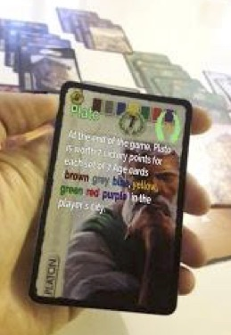
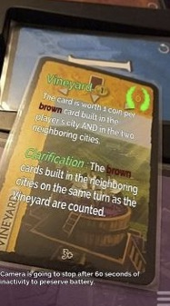
* Η επαύξηση του παιχνιδιού γίνεται με φυσικό τρόπο χωρίς να αλλάζει την
αίσθηση του παραδοσιακού – φυσικού παιχνιδιού. (Iwata, Yamabe, Polojärvi, & Nakajima, 2010), (Hinske & Langheinrich, 2009), (Wetzel, McCall, Braun, & Broll, 2008), (Xu, και συν., 2008)
* Το παιχνίδι παίζεται και με τον παραδοσιακό τρόπο ακόμη και χωρίς την τεχνολογία της επαύξησης. (Hinske & Langheinrich, 2009)
* Οι υποστηριζόμενες ενέργειες προσδιορίζονται ξεκάθαρα. (Hinske & Langheinrich, 2009)
* Ο χρήστης δεν υπερφορτώνεται γνωστικά και απαλλάσσεται από περιττές ενέργειες (π.χ. άθροιση της βαθμολογίας) με τους κατάλληλους αυτοματισμούς.
(Iwata, Yamabe, Polojärvi, & Nakajima, 2010), (Köffel & Haller, 2008)
* Η εστίαση είναι στο παιχνίδι. (Hinske & Langheinrich, 2009)
* Η λειτουργία της τεχνολογίας είναι απλή και δε χρειάζεται συντήρηση. (Hinske & Langheinrich, 2009), (Mortel & Hu, 2007)
* Η επαύξηση προκαλεί το ενδιαφέρον του χρήστη και τον κάνει να θέλει να παίξει το παιχνίδι με χρήση της επαυξημένης πραγματικότητας. (Xu, και συν., 2008)
* Η τεχνολογία εντοπισμού είναι κατάλληλη και λειτουργεί με ακρίβεια. (Iwata, Yamabe, Polojärvi, & Nakajima, 2010), (Wetzel, McCall, Braun, & Broll, 2008)

Roar! Catch the Monster

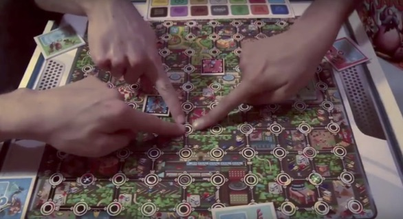
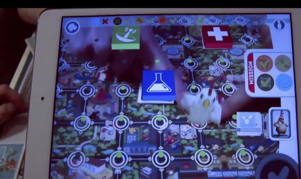

Οι υποστηριζόμενες ενέργειες προσδιορίζονται ξεκάθαρα. (Hinske & Langheinrich, 2009)
* Ο χρήστης δεν υπερφορτώνεται γνωστικά και απαλλάσσεται από περιττές ενέργειες με τους κατάλληλους αυτοματισμούς. (Iwata, Yamabe, Polojärvi, & Nakajima,
2010), (Köffel & Haller, 2008)
* Η εστίαση είναι στο παιχνίδι. (Hinske & Langheinrich, 2009)
* Η λειτουργία της τεχνολογίας είναι απλή και δε χρειάζεται συντήρηση. (Hinske & Langheinrich, 2009), (Mortel & Hu, 2007)
* Η τεχνολογία εντοπισμού είναι κατάλληλη και λειτουργεί με ακρίβεια. (Iwata, Yamabe, Polojärvi, & Nakajima, 2010), (Wetzel, McCall, Braun, & Broll, 2008)
* Άμεση και συνεχής ανατροφοδότηση και απλή και αποτελεσματική πρόσβαση στην πληροφορία. (Hinske & Langheinrich, 2009), (Köffel & Haller, 2008)
* Υποστήριξη αλλά και παρακίνηση της φυσικής και κοινωνικής διάδρασης μεταξύ των παικτών, της ομαδικότητας, της συνεργατικότητας αλλά και της ανταγωνιστικότητας. (Köffel & Haller, 2008), (Mortel & Hu, 2007), (Xu, και συν., 2008)

Ένα βασικό μειονέκτημα που είναι ενάντια στις αρχές σχεδίασης είναι ότι το παιχνίδι δεν μπορεί να παιχτεί χωρίς την τεχνολογία της επαύξησης.

Detetive AR

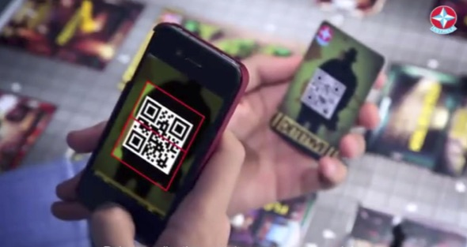
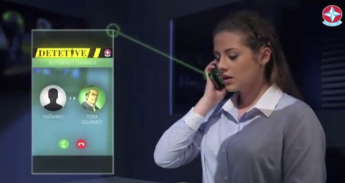

* Η επαύξηση του παιχνιδιού γίνεται με φυσικό τρόπο χωρίς να αλλάζει την αίσθηση του παραδοσιακού – φυσικού παιχνιδιού. (Iwata, Yamabe, Polojärvi, & Nakajima, 2010), (Hinske & Langheinrich, 2009), (Wetzel, McCall, Braun, & Broll, 2008), (Xu, και συν., 2008)
* Το παιχνίδι παίζεται και με τον παραδοσιακό τρόπο ακόμη και χωρίς την τεχνολογία της επαύξησης. (Hinske & Langheinrich, 2009)
* Οι υποστηριζόμενες ενέργειες προσδιορίζονται ξεκάθαρα. (Hinske & Langheinrich, 2009)
* Ο χρήστης δεν υπερφορτώνεται γνωστικά και απαλλάσσεται από περιττές ενέργειες (π.χ. άθροιση της βαθμολογίας) με τους κατάλληλους αυτοματισμούς.
(Iwata, Yamabe, Polojärvi, & Nakajima, 2010), (Köffel & Haller, 2008)
* Η εστίαση είναι στο παιχνίδι. (Hinske & Langheinrich, 2009)
* Η λειτουργία της τεχνολογίας είναι απλή και δε χρειάζεται συντήρηση. (Hinske & Langheinrich, 2009), (Mortel & Hu, 2007)
* Η επαύξηση προκαλεί το ενδιαφέρον του χρήστη και τον κάνει να θέλει να παίξει το παιχνίδι με χρήση της επαυξημένης πραγματικότητας. (Xu, και συν., 2008)
* Άμεση και συνεχής ανατροφοδότηση και απλή και αποτελεσματική πρόσβαση στην πληροφορία. (Hinske & Langheinrich, 2009), (Köffel & Haller, 2008)
* Υποστήριξη αλλά και παρακίνηση της φυσικής και κοινωνικής διάδρασης μεταξύ των παικτών, της ομαδικότητας, της συνεργατικότητας αλλά και της ανταγωνιστικότητας. (Köffel & Haller, 2008), (Mortel & Hu, 2007), (Xu, και συν., 2008)
Ένα βασικό μειονέκτημα που είναι ενάντια στις αρχές σχεδίασης είναι η τεχνολογία εντοπισμού που χρησιμοποιεί (QR Code) η οποία δεν είναι τόσο διακριτική και αποσπάει την προσοχή του χρήστη από το παιχνίδι. Θα μπορούσαν να χρησιμοποιηθούν πιο διακριτικά σημεία εντοπισμού που αναγνωρίζουν το αντικείμενο πιο άμεσα και χωρίς ιδιαίτερη προσπάθεια από τον χρήστη.

### Ερώτημα 3 – Προδιαγραφές εφαρμογής
Επειδή δεν υπάρχουν πόροι για την ανάπτυξη πολλών εναλλακτικών θα πρέπει να εστιάσουμε την προσοχή μας μόνο σε ένα υποσύνολο χρηστών και λειτουργιών της εφαρμογής.

Για τις αρχικές προδιαγραφές θα πρέπει να αναφέρετε:
1) προφίλ χρήστη,
2) στόχος χρήστη,
3) πλαίσιο χρήσης, καθώς και
4) τις βασικές οδηγίες σχεδίασης που θα εφαρμόσετε, όπως τις ορίσατε στο Α1
[5 μονάδες]

#### Απάντηση
1) προφίλ χρήστη: Άνθρωποι ηλικίας από 5 εως 105 που θέλουν να περάσουν όμορφες στιγμές με την παρέα τους παίζοντας risk είτε βρίσκονται στον ίδιο χώρο είτε απομακρυσμένα.
2) στόχος χρήστη : Ψυχαγωγία, ανταλλαγή ιδεών, ψυχολογική ανάταση, δράση, σύσφιξη σχέσεων με άλλους ανθρώπους.
3) πλαίσιο χρήσης: Στον ελεύθερο χρόνο, ως παιχνίδι ψυχαγωγίας, Με συμμετοχή παικτών στον ίδιο χώρο είτε από μακριά μέσω διαδικτύου.
4) βασικές οδηγίες σχεδίασης: Λειτουργία του παιχνιδιού με τους παραδοσιακούς κανόνες, επαύξηση του παιχνιδιού και όχι αλλαγή του, εμπλοκή του χρήστη όσο το δυνατόν λιγότερο με το τεχνολογικό κομμάτι του παιχνιδιού, δυνατότητα χρήσης είτε απομακρυσμένα είτε στον ίδιο χώρο, κοινωνική δικτύωση.

## Μέρος B – Σχεδίαση της διάδρασης: 30 μονάδες

Σε αυτό το μέρος θα γίνει η σχεδίαση της διάδρασης για την εφαρμογή που μελετήθηκε στο πρώτο μέρος.

### Ερώτημα 1 – Ανάπτυξη Σεναρίου
Παρουσιάστε το σενάριο χρήσης της εφαρμογής σας. Για τον σκοπό αυτό είναι χρήσιμη η ύλη (σενάριο: Dix 5.5)  [5 μονάδες]

#### Απάντηση
Παρασκευή βράδυ, η Μαρία είναι νυχτερινή απόψε. Ο κλήρος του babysitting πέφτει στον Γιώργο. Τα παιδιά δεν κοιμήθηκαν το μεσημέρι οπότε έχει την ευκαιρία να ξεμπερδέψει νωρίς με το να τα κοιμήσει. Ο Αλέξανδρος 3,5 χρονών τρελαίνεται για παραμύθια πριν κοιμηθεί. Η μικρή Αριάδνη 1,5 χρονών προτιμάει να χοροπηδάει στην κούνια της έχοντας αγκαλιά το μικρό καφέ αρκουδάκι που της είχε χαρίσει η γιαγιά Ιωάννα. Ο μικρός Αλέξανδρος κοιμήθηκε μετά από 3 σελίδες διαβάσματος του παραμυθιού. Η Αριάδνη αποδεικνύεται πιο δύσκολη περίπτωση. Από το κινητό του ακούγεται ο ίχος της ειδοποίησης. Έχοντας αγκαλιά την μικρούλα του κοιτάει την ενημέρωση «σε 20 λεπτά ξεκινάει το μεγάλο παιχνίδι! Δείξε τους ποιός είναι ο μεγάλος κατακτητής!» Σκεπτόμενος με λαχτάρα την ελευθερία του που όλο την πλησίαζε και όλο και δεν την έφτανε αποφάσισε να καταφύγει σε πιο δραστικές λύσεις. Μεγάλος εφευρέτης ο άνθρωπος που σκέφτηκε την πιπίλα μονολόγησε. Η μικρή Αριάδνη κοιμάται πλέον σαν αγγελούδι κάτω από τα ζεστά της σκεπάσματα. Ο Γιώργος Κοιτάει το ρολόι. Σε 10 λεπτά ξεκινάει το μεγάλο γεγονός της εβδομάδας. Όπως άλλοτε οι καλοί φίλοι της παρέας έχουν ραντεβού στις 10 το βράδυ της Παρασκευής για να παίξουν Risk. Ανοίγει το κουτί και στρώνει στο τραπεζάκι του σαλονιού όλα τα παρελκόμενα. Τον Χάρτη, τα κίτρινα στρατιωτάκια και τις κάρτες του. Ανοίγει το τάμπλετ του και στη συνέχεια ανοίγει την εφαρμογή Risk AR. Βάζει στην βάση στήριξης το τάμπλετ και προσαρμόζει την κάμερά του να εστιάζει στα όρια του πίνακα- χάρτη.Ο Γιώργος πατάει την επιλογή «νέο παιχνίδι». Το παιχνίδι τον καλωσορίζει με το όνομά του. Μέσα σε 5 λεπτά έχουν μπει και οι άλλοι τρεις της παρέας. Ο καθένας με το δικό του προφίλ και τα δικά του χρώματα. Το παιχνίδι αρχίζει. Στη οθόνη του τάμπλετ πλέον φαίνονται και οι άλλοι τρεις με τα εικόνικά τους στρατιωτάκια. Σε κάθε μάχη τα στρατιωτάκια ζωντανεύουν και η μάχη είναι ρεαλιστική. Ο Φοίβος όπως πάντα δείχνει ό,τι κερδίζει έδαφος. Έχει καταλάβει την Ασία και την Αφρική ήδη. Έχει ήδη τα μπόνους στατεύματα που κάνουν τη διαφορά. Σε κάθε μια από τις γωνίες του τάμπλετ εμφανίζονται τα πρόσωπα των παιχτών. Τα πειράγματα πάνε και έρχονται. Ο Γιώργος προσπαθεί να κρατήσει τα γέλια του για να μην ξυπνήσει τα παιδάκια. Ο Αλέκος έχει αρχίσει να ζορίζεται ήδη. Του έχει μείνει η Ωκεανία. Δεν τον πειράζει όμως γιατί έχει μεριμνήσει και έχει πάρει τουλάχιστον την μπύρα που του αρέσει από την κάβα της γειτονιάς. Η ώρα περνάει και ο Φοίβος για άλλη μια φορά αποδεικνύει ό,τι 20 χρόνια σκακιστής έχει πλεονέκτημα απέναντι στους άλλους. Έχουν μείνει μόνο ο Γιώργος και ο Φοίβος. Ο Φοίβος ρίχνει την τελευταία ζαριά που θα κρίνει το παιχνίδι. Το εικονικό ζάρι στην οθόνη του Γιώργου δείχνει άσσο. Ο Γιώργος είναι επιτέλους νικητής και βγάζει την πολεμική του κραυγή νίκης που συνήθιζε να βγάζει εκείνα τα φοιτητικά και ξένoιαστα χρόνια στην Γκαρσονιέρα του Νικόλα. Η Αριάδνη απαντάει με την δική της πολεμική κραυγή ενώ ο Αλέξανδρος συνεχίζει το ύπνο του από το άλλο πλευρό. Ο ερχομός της Μαρίας στις 3 ώρα βρίσκει τον Γιώργο αποκοιμισμένο στον καναπέ αγκαλιά με την μικρή Αριάδνη η οποία πλέον κρατάει ένα κίτρινο στρατιωτάκι αντί του αγαπημένου της αρκούδου.

### Ερώτημα 2 – Περσόνα
Καταγράψτε σε μορφή [persona](https://www.interaction-design.org/literature/book/the-encyclopedia-of-human-computer-interaction-2nd-ed/personas) τους βασικούς χρήστες σας (περισσότερα από ένα personas) [5 μονάδες]

#### Απάντηση
Ο Γιώργος:
Ο Γιώργος είναι από την Καλαμάτα και είναι 35 χρονών. Ήρθε στη Αθήνα 18 χρονών όταν πέρασε στην σχολή Γραφιστική του Τ.Ε.Ι Αθηνών. Μετά από μια οδύσσεια εναλλαγής εργοδοτών κατέληξε εδώ και 3 χρόνια μετά από σκληρή δουλειά να ανοίξει το δικό του γραφείο. Αγαπάει πολύ αυτό που κάνει και αφιερώνει πολλές ώρες στην συνεχή ανάπτυξή της μικρής του εταιρείας. Οι απαιτήσεις και οι ευθύνες όμως στη ζωή του Γιώργου χρειάζονται και και ένα προσωπικό αντίβαρο όπως είνια η καλή του σχέση με τους φίλους του.
Είναι γονιός 2 μικρών παιδιών. Η εργασία του σε συνδυασμό με τις οικογενειακές υποχρεώσεις αφήνει ελάχιστο χρονικό περιθώριο να επισκευτεί του φίλους του. Έχει μια ευτυχισμένη οικογένεια, την υγεία του και την εργασία του. Συχνά κάθεται και αναπολεί τις ξένoιαστες φοιτητικές στιγμές που περνούσε με την παρέα παίζοντας ώρες αργά το βράδυ το αγαπημένο τους επιτραπέζιο παιχνίδι και συζητώντας με αφορμή το παιχνίδι τη ζωή και τα όνειρα τους. Όλοι οι φίλοι του πλέον κατοικούν εκτός Ελλάδας.
Είναι καλός χρήστης τάμπλετ και smartphone και τα χρησμοποιεί σαν εργαλεία της δουλειάς του.
Όνειρό του είναι να του ανατεθεί κάποτε από την πολιτεία η διαμόρφωση όλων των γκρίζων τοίχων στους άχαρους και μουντούς δρόμους της Αθήνας.
Ο Φοίβος:
Ο Φοίβος εδώ και δύο χρόνια κατοικεί στο Λονδίνο όπου και εργάζεται ως προγραμματιστής. Αποφάσισε το μεγάλο βήμα της μετανάστευσης για να ακολουθήσει τους δύο έρωτες της ζωής του. Από τη μια τον προγραμματισμό παιχνιδιών και από την άλλη την Τζένη την συμφοιτήτριά του. Η Τζένη είχε καταγωγή από την Αγγλία και έτσι στους δύσκολους καιρούς της οικονομικής κρίσης απόφάσισε να φύγει για την δεύτερή της πατρίδα.
Ο Φοίβος εργάζεται κανονικά στο οκτάωρό του και στον ελεύθερό του χρόνο αθλείται σε μια τοπική ομάδα badminton όπως επίσης αγαπάει να κάνει εξορμήσεις στις υπόλοιπες ευρωπαϊκές χώρες μαζί με την αγαπημένη του. Οι συνθήκες διαβίωσής του είναι πολύ καλές αλλά το πρόβλημά του είναι η μοναξιά του ζευγαριού μιας και δεν έχουν βρει ακόμα το είδος της παρέας που ζητάνε.
Ο Φοίβος είναι καλός χρήστης κινητών συσκευών.
Όνειρό του να βγάλει τόσα λεφτά που τελικά θα τα παρατήσουν όλα με την Τζένη και θα πάνε να ζήσουν σε μια καλύβα στην Ικαρία μαζί με όλους του υπόλοιπους της παρέας. Όπως έκαναν στις διακοπές τους πριν πολλά χρόνια.

### Ερώτημα 3 – Ενδεικτικές οθόνες
Για το σενάριο και τις περσόνες που αναπτύξατε στα παραπάνω σχεδιάστε ενδεικτικές οθόνες με χρήση [κάποιου εργαλείου κατασκευής υποδείγματος](http://concept.ly/). Για τον σκοπό αυτό είναι χρήσιμη η ύλη (ενδεικτικές οθόνες Dix 5.7) [10 μονάδες]

#### Απάντηση
Το παιχνίδι έχει ξεκινήσει και αναμένει τους υπόπλοιπους της παρέας. Η εικόνα του Risk είναι του πραγματικού χάρτη του παιχνιδιού. Ουσιαστικά γίνεται επαύξηση του φυσικού παιχνιδιού. Συνδέονται και οι υπόλοιποι. Σε κάθε σύνδεση παίκτη εμφανίζεται η εικόνα του και ακούγεται η φωνή του. Ανα πάσα στιγμή μπορεί ο καθένας να μιλήσει. To παιχνίδι είναι σε εξέλιξη. Οι παίχτες μπορούν και επικοινωνούν μεταξύ τους ηχητικά και οπτικά. Κάθε φυσικό αντικείμενο του παιχνιδιού του κάθε χρήστη εμφανίζεται εικονικά στους υπόλοιπους τρεις. Κατά τη διάρκεια της κάθε μάχης εμφανίζεται animation μάχης με ήχους μάχης και οπτικά εφέ. Αυτό βοηθάει στο να βιώσουν καλύτερα την σύγκρουση και μέσω της συναισθηματικής φόρτισης και εναλλαγής να ζήσουν πιο έντονα την εμπειρία.

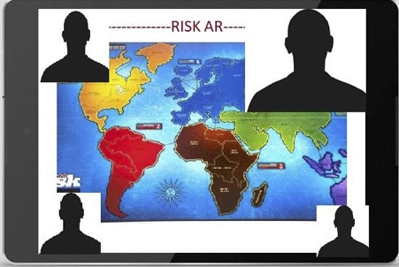
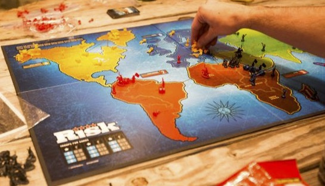

Οι παίχτες που χάνουν φαίνονται ανενεργοί με εφέ, χωρίς βέβαια να αποκλείονται από το να συμμετέχουν σε καυστικά σχόλια και πειράγματα. Το τάμπλετ σε όλη τη διάρκεια του παιχνιδιού «βλέπει» το πραγματικό πίνακα του επιτραπέζιου παιχνιδιού. Είναι χαρτογραφημένες ήδη η ήπειροι και οι στρατιώτες εντοπίζονται με το χρώμα τους. Οι κάρτες είναι ήδη καταχωρημένες ως εικόνες. Αυτό σημαίνει ό,τι ο κάθε χρήστης παίζει κανονικά στο φυσικό παιχνίδι και τα αποτελέσματα φαίνονται επαυξημένα στα τάμπλετ των άλλων παικτών. Η κάμερα σε όλη τη διάρκεια του παιχνιδιού διαβάζει τα στρατιωτάκια τα οποία τα επαυξάνει και τα εμφανίζει στο τάμπλετ του κάθε χρήστη. Το ίδιο ισχύει για τις κάρτες και τα ζάρια.

### Ερώτημα 4 – Σχεδίαση customer journey
Σχεδιάστε το [customer journey](https://www.nngroup.com/articles/customer-journey-mapping/) της εφαρμογής για μια τουλάχιστον από τις περσόνες (τελικούς χρήστες) που εντοπίσατε στο Ερώτημα 2, μαζί με την σύντομη τεκμηρίωση (εξήγηση των επιλογών) και περιγραφή της διαδικασίας που ακολουθήθηκε [10 μονάδες]

#### Απάντηση

## Μέρος Γ - Προγραμματισμός της διάδρασης, 40 μονάδες

Σε αυτό το μέρος θα γίνει η κατασκευή του λογισμικού για μια τυπική εφαρμογή γεωγραφικού χάρτη με διαφορετικές τεχνικές και συσκευές διάδρασης με τον χρήστη.

### Ερώτημα 1 – web
Αναπτύξτε μια εφαρμογή σχεδίασης διανυσμάτων χάρτη η οποία επιτρέπει την σχεδίαση, καθώς και την αποθήκευση-ανάκτηση από server μιας τεθλασμένης γραμμής πολλών σημείων, π.χ., μια διαδρομή από σημείο Α σε Β στους δρόμους μια πόλης. Στα παρακάτω λινκ μπορείτε να βρείτε ενδεικτική τεκμηρίωση για μια πιθανή υλοποίηση.
https://stackoverflow.com/questions/42939633/how-to-draw-a-polyline-using-the-mouse-and-leaflet-js
https://firebase.google.com/docs/database/web/start
[15 μονάδες]

#### Απάντηση
Για την αντιμετώπιση των ζητουμένων του ερωτήματος αναπτύξαμε κώδικα HTML και Javascript.
Για την αποθήκευση και ανάκτηση της τεθλασμένης γραμμής από Server χρησιμοποιήσαμε την υπηρεσία βάσεων δεδομένων της Firebase – Google.
Επίσης χρησιμοποιήσαμε το API της Google για την υπηρεσία των χαρτών της Google.
Συνδεθήκαμε στην Google με το προσωπικό μας account και προμηθευτήκαμε το API_KEY που χρησιμοποιήσαμε για την ανάπτυξη του θέματος.
Επίσης χρησιμοποιήσαμε το account της Google για την πρόσβαση στις υπηρεσίες της Firebase.
Ο κώδικας είναι διαθέσιμο στο αναγνώστη από το σύνδεσμο που βρίσκεται εδώ.
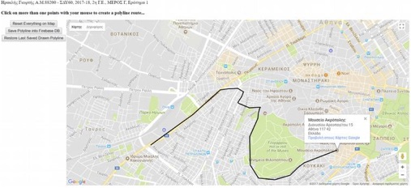

### Ερώτημα 2 – Android
Απαντήστε το ερώτημα 1 με μια εφαρμογή για κινητό Android.
https://developers.google.com/maps/documentation/android-api/polygon-tutorial
https://firebase.google.com/docs/database/android/start/
[15 μονάδες]

#### Απάντηση

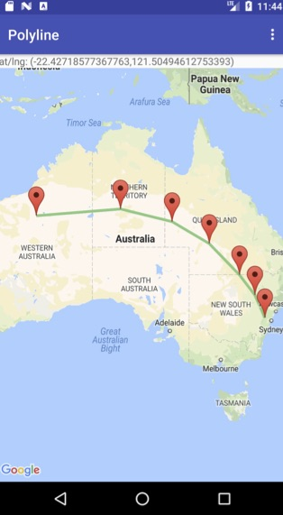
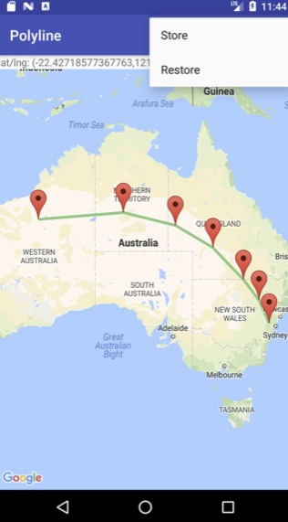

Το όνομα της εφαρμογής είναι Polyline. Στο ανώτερο δεξί μέρος της εφαρμογής τοποθετείται το μενού επιλογής. Η χρήση του παρέχει τα εξής πλεονεκτήματα στην διάδραση:
• Εύκολος εντοπισμός του από τον χρήστη.
• Αποφυγή κούρασης και αποσυντονισμού κατά την σύντομη μάθηση χειρισμού.
• Χρήση του ελάχιστα δυνατού χώρου από την διεπιφάνεια ώστε να μην παρεμποδίζεται η διάδραση του χρήστη με την εφαρμογή.

Η τεθλασμένη γραμμή σχεδιάζεται από τον χρήστη αφού ορίσει τα σημεία της διαδρομής με markers πατώντας μακρά στην οθόνη αφής, χρησιμοποιήθηκε η μακρά λειτουργία ώστε να μην παρεμβάλλεται στις λειτουργίες διάδρασης swipe και zoom in/out. Στη συνέχεια η επιλογή των markers με άγγιγμα οδηγεί στον σχεδιασμό του μονοπατιού. Η γραμμή έχει απαλό χρώμα και κατάλληλο μέγεθος για να μην επηρεάζει τα γραφικά του χάρτη ή αλλοιώνει τις πληροφορίες που παρέχει (διευθύνσεις, ιστορικές τοποθεσίες κλπ). Η εφαρμογή δίνει την δυνατότητα σχεδιασμού και αποθήκευσης των σημείων της γραμμής στην firebase.

Στην μέθοδο onMarkerClick λαμβάνονται οι θέσεις των markers που επιλέγονται από τον χρήστη, οι οποίες χρησιμοποιούνται για τον σχεδιασμό και ενσωμάτωση της γραμμής στον χάρτη. H μέθοδος onOptionsItemSelected ενεργοποιείται από το μενού, η επιλογή “Store”, δηλαδή αποθήκευση των σημείων της τεθλασμένης στην βάση δεδομένων είναι το πρώτο case. Χρησιμοποιήθηκε το break statement διότι εμφανιζόταν σφάλμα και τερματιζόταν η εφαρμογή. Κατά την επιτυχή αποστολή των δεδομένων εμφανίζεται Toast κείμενο

### Ερώτημα 3 – Υβριδική
Απαντήστε το ερώτημα 1 με μια υβριδική κινητή εφαρμογή, δλδ που εκτελείται σε κινητό αλλά βασίζεται σε τεχνολογίες web. Για τον σκοπό αυτό μπορείτε να χρησιμοποιήσετε είτε τεχνολογίες κινητών σελίδων είτε κάποιο εργαλείο, π.χ., phonegap.
[10 μονάδες]

#### Απάντηση
Για την αντιμετώπιση του ζητήματος ακολουθήσαμε τη εξής διαδικασία.
Αρχικά εγκαταστήσαμε την Desktop εφαρμογή PhoneGap (v0.4.5) στο laptop που εργαζόμαστε, την οποία διαθέτει μέσω του συνδέσμου htps://phonegap.com/ η Adobe Systems Incorporated.
Κατόπιν εγκαταστήσαμε σε ένα Tablet την εφαρμογή PhoneGap για κινητές συσκευές την οποία μπορέσαμε να βρούμε στο Google Play.
Εκκινήσαμε την Desktop εφαρμογή PhoneGap στο φορητό υπολογιστή, όπου τρέχει και ο server του PhoneGap.
Δημιουργήσαμε ένα καινούριο project και χρησιμοποιήσαμε στο project αυτό το αρχείο και τον κώδικα που υλοποιήσαμε σε προηγούμενο ερώτημα (Μέρος Γ’, Ερώτημα 1).
Μετονομάσαμε το αρχείο σε index.html και αντικαταστήσαμε με αυτό το αντίστοιχο αρχείο Index.html που βρίσκεται στο φάκελο www του project που δημιουργήσαμε.
Στη συνέχεια τρέξαμε την εφαρμογή στο tablet που χρησιμοποιήσαμε προηγούμενα.
Δίνοντας την κατάλληλη διεύθυνση IP συνδεθήκαμε στο Server που τρέχει στο laptop.
Εν συνεχεία φορτώθηκε η σελίδα index.html στο Tablet και έτρεξε η εφαρμογή μας αντίστοιχα, όπως είχε περιγραφεί και στο Ερώτημα 1 του Γ’ Μέρους της εργασίας.

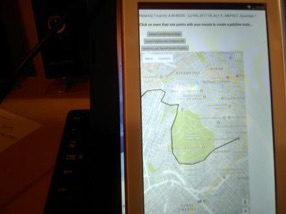

## Μέρος Δ – Παρουσίαση ενός επιστημονικού άρθρου, 10 μονάδες μπόνους

Για την καλύτερη εξοικείωση με την αναζήτηση στην επιστημονική βιβλιογραφία καθώς και για την έμμεση μελέτη σχετικού θεωρητικού περιεχομένου:

A) Βρείτε ένα άρθρο στην περιοχή της διάδρασης με συσκευές χρήστη για τον Διάχυτο Υπολογισμό. Το άρθρο θα πρέπει να έχει δημοσιευτεί σε σημαντικό συνέδριο-περιοδικό και θα πρέπει να είναι τουλάχιστον 5 ετών με τουλάχιστον 10 ετεροαναφορές/έτος

B) Ετοιμάστε μια παρουσίαση με 5 διαφάνειες όπου τουλάχιστον οι 3 διαφάνειες θα είναι η ανάλυση και κριτική που θα κάνετε πάνω στο άρθρο και μόνο οι 2 διαφάνειες θα είναι η παρουσίαση του ίδιου του άρθρου. Για τον σκοπό αυτό θα πρέπει να εστιάσετε σε μερικά σημεία του άρθρου (π.χ., μεθοδολογία, αποτελέσματα) και όχι να προσπαθείσετε να το παρουσιάσετε συνολικά.

Η βαθμολόγηση θα γίνει με βάση την συμβατότητα με το περιεχόμενο της ΘΕ (δλδ, απαιτείται προσεκτική μελέτη της ύλης) και κυρίως με βάση την ανάλυση-κριτική που θα κάνετε πάνω στο άρθρο, π.χ., προτάσεις για εναλλακτικά συστήματα ή τεχνικές αξιολόγησης. Η παρουσίαση θα γίνει στην ΟΣΣ2 και για την βαθμολόγηση της ΓΕ2 θα συμπεριλάβετε το αρχείο της παρουσίασης ή ένα λινκ προς αυτό στην απάντηση.

#### Απάντηση

Δώστε την απάντηση. Εάν δεν έχετε δώσει απάντηση γράψτε με κεφαλαία γράμματα,
ΔΕΝ ΑΠΑΝΤΗΘΗΚΕ Εάν εν γνώση σας δίνετε ελλιπή απάντηση γράψτε με κεφαλαία
γράμματα, ΕΛΛΙΠΗΣ ΑΠΑΝΤΗΣΗ.
