# ΕΛΛΗΝΙΚΟ ΑΝΟΙΚΤΟ ΠΑΝΕΠΙΣΤΗΜΙΟ, ΣΧΟΛΗ ΘΕΤΙΚΩΝ ΕΠΙΣΤΗΜΩΝ ΚΑΙ ΤΕΧΝΟΛΟΓΙΑΣ

## ΠΡΟΓΡΑΜΜΑ ΣΠΟΥΔΩΝ «ΣΧΕΔΙΑΣΗ ΚΑΙ ΑΝΑΠΤΥΞΗ ΣΥΣΤΗΜΑΤΩΝ ΔΙΑΧΥΤΟΥ ΥΠΟΛΟΓΙΣΜΟΥ»

ΘΕΜΑΤΙΚΗ ΕΝΟΤΗΤΑ: ΣΔΥ60
ΑΚΑΔΗΜΑΪΚΟ ΕΤΟΣ: 2017-2018

### ΣΤΟΙΧΕΙΑ ΠΟΥ ΣΥΜΠΛΗΡΩΝΕΙ Ο ΦΟΙΤΗΤΗΣ / Η ΦΟΙΤΗΤΡΙΑ

Υπεύθυνη Δήλωση Φοιτητή: Βεβαιώνω ότι είμαι συγγραφέας αυτής της εργασίας και ότι κάθε βοήθεια την οποία είχα για την προετοιμασία αυτής της εργασίας, είναι πλήρως αναγνωρισμένη και αναφέρεται είτε στο σημείο «Σχόλια προς καθηγητή» είτε μέσα στην εργασία. Επίσης έχω αναφέρει τις όποιες πηγές από τις οποίες έκανα χρήση δεδομένων, ιδεών ή λέξεων, είτε αυτές αναφέρονται ακριβώς είτε παραφρασμένες. Επίσης βεβαιώνω ότι αυτή η εργασία προετοιμάστηκε από εμένα προσωπικά ειδικά για τη συγκεκριμένη Θεματική Ενότητα.

☒ Συμφωνώ και αποδέχομαι την ανωτέρω δήλωση

☐ Δε συμφωνώ και δεν αποδέχομαι την ανωτέρω δήλωση (στην περίπτωση αυτή, ο Κ-Σ έχει δικαίωμα να μην αξιολογήσει την εργασία του φοιτητή)

Ημερομηνία ανακοίνωσης εργασίας:
Ημερομηνία παράδοσης εργασίας:
Καταληκτική ημερομηνία παραλαβής:

Καταληκτική ημερομηνία παραλαβής σε περίπτωση ατομικής παράδοσης:

### ΣΤΟΙΧΕΙΑ ΠΟΥ ΣΥΜΠΛΗΡΩΝΕΙ Ο ΚΑΘΗΓΗΤΗΣ

ΣΧΟΛΙΑ ΠΡΟΣ ΦΟΙΤΗΤΗ / ΦΟΙΤΗΤΡΙΑ:

## ΣΤΟΙΧΕΙΑ ΕΚΠΑΙΔΕΥΤΙΚΟΥ ΕΝΔΙΑΦΕΡΟΝΤΟΣ
### Σκοπός ΓΕ

Στην ΓΕ γίνεται μια εισαγωγή στην ανάλυση και σχεδίαση της διάδρασης με τεχνικές και εργαλεία κατασκευής πρωτοτύπων αναφορικά με το παρακάτω θέμα:

Υποθέστε ότι είστε σύμβουλος σε ένα έργο δημιουργίας μιας κινητής εφαρμογής για την επαύξηση του φυσικού-χάρτινου βιβλίου. Οι περισσότερες εμπορικές προσπάθειες έχουν μετατρέψει το παραδοσιακό χάρτινο βιβλίο σε ηλεκτρονικό χωρίς όμως να εκμεταλλεύονται τα πλεονεκτήματα της ηλεκτρονικής μορφής και χωρίς να επαυξάνουν αυτά της χάρτινης μορφής. Η παρούσα κατάσταση του ηλεκτρονικού βιβλίου θυμίζει τις πρώτες ημέρες της τηλεόρασης, όπου η παραγωγή-κατανάλωση περιεχομένου γινόταν αντιληπτή ως "ραδιόφωνο με εικόνα".

**Για το ερώτημα Α1** θέλουμε να απαντήσουμε στο γενικό ερώτημα: Πως θα μπορούσαμε να επαυξήσουμε το φυσικό βιβλίο σε συνδυασμό με μια έξυπνη φορητή συσκευή?

**Για το ερώτημα Α3** το βιβλίο που θα διαλέξετε για αναμόρφωση μπορεί να είναι ένα της επιλογής σας από το πεδίο των επιστημών και της τεχνολογίας για την 2βάθμια ή 3βάθμια εκπαίδευση.

**Για το Μέρος Β** ο στόχος είναι μια εφαρμογή που θα μπορούσε να εκτελείται σε έξυπνο κινητό τηλέφωνο και θα επαυξάνει την χρησιμότητα του φυσικού βιβλίου με διασκεδαστικό και συμμετοχικό τρόπο.

*Σχετικά έργα:*
* [booksecrets](https://booksecrets.com/).
* [Explorable Explanations](http://worrydream.com/ExplorableExplanations/)

### Προσδοκώμενα (μαθησιακά) αποτελέσματα

Με την επιτυχή ολοκλήρωση αυτής της εργασίας, θα έχετε:

Α) Πρακτική εμπειρία σχεδίασης της διάδρασης ανθρώπου-υπολογιστή.
Β) Πρακτική εμπειρία ανάλυσης της διάδρασης με συσκευές χρήστη
Γ) Πρακτική επαφή με λογισμικό δημιουργίας πρωτοτύπων.

## Μέθοδος και παραδοτέα

Κάθε εργασία περιέχει ερωτήματα που αφορούν στην αναζήτηση βιβλιογραφίας (άρθρα, λινκ, βίντεο). Στόχος είναι να αναπτύξετε τις απαντήσεις σας ως μια κριτική σύνθεση, να επιλέξετε τα καταλληλότερα άρθρα, να συνθέσετε συλλογισμούς από αυτά και να παραθέσετε τη δική σας προοπτική. Σημαντικό είναι να τονίσουμε ότι αναζητούμε κριτική σύνθεση και όχι απλά παράθεση εναλλακτικών λύσεων-προτάσεων από διαφορετικές πηγές, οπότε η βαθμολόγηση δίνει έμφαση στην ποιότητα της σύνθεσης και όχι στην ποσότητα των βιβλιογραφικών αναφορών.

*Παραδοτέα:* Για κάθε ερώτημα που ζητάει οθόνες από εφαρμογές ή απαιτεί εκτέλεση κώδικα η απάντηση θα πρέπει να περιλαμβάνει μία ή περισσότερες ενδεικτικές οθόνες (screenshot) όπου θα φαίνεται τόσο το περιβάλλον ανάπτυξης με τον κώδικα καθώς και το αποτέλεσμα της εκτέλεσης. Η αναφορά περιέχει μόνο τις ενδεικτικές οθόνες, τις οποίες καλό είναι να έχετε αποθηκεύσει σε χωριστό φάκελο (π.χ., images), ώστε να βεβαιωθείτε ότι δεν είναι πολύ μεγάλες (π.χ., 100Kb για κάθε εικόνα είναι συνήθως αρκετά). Ο πηγαίος κώδικας θα πρέπει να βρίσκεται σε ξεχωριστούς φακέλους για κάθε ερώτημα. Βίντεο ή/και εκτελέσιμος κώδικας είναι προαιρετικά και στέλνονται μόνο με κάποιο λινκ σε υπηρεσία διαμοιρασμού αρχείων και όχι μέσω του study.eap.gr το οποίο έχει πολύ μικρά περιθώρια για μεγάλα αρχεία, όπως μεγάλες εικόνες, βίντεο, και εκτελέσιμα.

## ΥΠΟΔΕΙΞΕΙΣ ΓΙΑ ΤΗ ΣΥΓΓΡΑΦΗ ΤΗΣ ΕΡΓΑΣΙΑΣ

Για την απάντηση της εργασίας θα πρέπει να χρησιμοποιηθεί το υπόδειγμα της εργασίας. Οι περισσότερες απαντήσεις βασίζονται σε ενδεικτικές οθόνες από την εκτέλεση λογισμικού, λεζάντες, σύντομες περιγραφές, και αναφορές σε βιβλιογραφία. Οι πολλές εικόνες ειδικά αν δεν έχουν επεξεργαστεί σωστά θα δημιουργήσουν μεγάλα αρχεία. Επειδή οι ενδεικτικές οθόνες μπορεί να μεγαλώσουν πολύ το μέγεθος του τελικού αρχείου ή να μην έχουν συνέπεια εμφάνισης σε διαφορετικούς υπολογιστές (ειδικά σε προγράμματα όπως το Microsoft Office), η τελικά αναφορά μπορεί να είναι σε *PDF* ή κατά προτίμηση *σε πηγαίο κείμενο markdown*. Για την μετατροπή από markdown σε PDF ή DOCX μπορείτε να χρησιμοποιήσετε το ελεύθερο λογισμικό pandoc. Για την επεξεργασία των πηγαίων αρχείων markdown μπορείτε να χρησιμοποιήσετε εφαρμογές (π.χ., http://atom.io, http://brackets.io) ή κάποιον online επεξεργαστή κειμένου (π.χ., https://stackedit.io, https://dillinger.io) που επιτρέπει την προεπισκόπηση (preview) του φορμαρισμένου κειμένου με τις εικόνες.

Μην ξεχάσετε να δηλώσετε εάν η εργασία αποτελεί προϊόν αποκλειστικά δικής σας εργασίας και να δώσετε αναφορά σε άρθρα και κώδικα τα οποία χρησιμοποιήσατε.

Αν δεν έχετε απαντήσει σε ένα ερώτημα γράψτε ΔΕΝ ΑΠΑΝΤΗΘΗΚΕ. Αν απαντήσατε με ελλείψεις σε ένα ερώτημα γράψτε ΑΠΑΝΤΗΘΗΚΕ ΕΛΛΙΠΩΣ

Η συνεργασία στην ανάλυση της εργασίας επιτρέπεται, αλλά καλό είναι να αναφερθεί στον ειδικό χώρο στην πρώτη σελίδα της εργασίας. Η συνεργασία δεν πρέπει να οδηγεί σε από κοινού επίλυση και συγγραφή της εργασίας. Η υποβολή κοινών απαντήσεων από διαφορετικούς φοιτητές που συνεργάστηκαν δεν επιτρέπεται και θεωρείται ως ΑΝΤΙΓΡΑΦΗ. Οι απαντήσεις ελέγχονται, τόσο μεταξύ των φοιτητών του ιδίου τμήματος, όσο και μεταξύ φοιτητών διαφορετικών τμημάτων. Η αντιγραφή έχει ως αποτέλεσμα το ΜΗΔΕΝΙΣΜΟ ΤΗΣ ΕΡΓΑΣΙΑΣ ΣΥΝΟΛΙΚΑ και την παραπομπή των παραβατών στην Κοσμητεία της Σχολής Θετικών Επιστημών & Τεχνολογίας, σύμφωνα με τον εσωτερικό κανονισμό του ΕΑΠ.

Ο φοιτητής θα πρέπει να στείλει την εργασία με μορφή συμπιεσμένου αρχείου zip ή rar. Το όνομα του αρχείου θα είναι: SDYxx_xERG_EPITHETO_ONOMA.zip (συμπληρώστε ανάλογα με τον κωδικό της ΘΕ xx και τον αριθμό x της εργασίας). Να γίνει χρήση λατινικών χαρακτήρων για την αποφυγή προβλημάτων.

Το συμπιεσμένο αρχείο θα πρέπει να αποτελείται από:
Ένα πηγαίο αρχείο κειμένου με όνομα SDYxx_xERG_EPITHETO_ONOMA.md που θα περιέχει την απάντηση της εργασίας (συμπληρώστε ανάλογα με τον κωδικό της ΘΕ xx και τον αριθμό x της εργασίας). Ένα φάκελο που θα περιέχει εικόνες της εργασίας σας. Ένα φάκελο με τον πηγαίο κώδικα.

H εφαρμογή των παραπάνω κανόνων είναι ΥΠΟΧΡΕΩΤΙΚΗ και βαθμολογείται σύμφωνα με το αντίστοιχο κριτήριο αξιολόγησης. Η μη εφαρμογή του πρώτου κανόνα μπορεί να οδηγήσει σε συνολική απόρριψη της εργασίας.

## Μέρος A – Αναλυση και Σχεδίαση: 50 μονάδες

Για την επιστημονική βιβλιογραφία θα βρείτε πολλά σχετικά άρθρα στα [Google Scholar](http://scholar.google.com) και [ResearchGate](https://www.researchgate.net/). Τα άρθρα που θα διαλέξετε θα πρέπει να έχουν τουλάχιστον δύο ετεροαναφορές/έτος (σύμφωνα με το Google Scholar) και να έχουν δημοσιευτεί μετά το 2007. Η αναφορά των άρθρων στο κείμενο σας θα πρέπει να γίνει με το στυλ APA και θα πρέπει να βρίσκεται στο τέλος της αντίστοιχης απάντησης.

### Ερώτημα 1 – Προηγούμενη έρευνα

Ο υπεύθυνος του έργου, είναι καλός γνώστης στο πεδίο του προγραμματισμού διεπαφής ανθρώπου υπολογιστή αλλά δε γνωρίζει αρκετά για τα ιδιαίτερα χαρακτηριστικά του κινητού υπολογισμού στο πλαίσιο του παραπάνω θέματος. Σας ζητά να του παραδώσετε δυο λίστες με αναφορά στην τρέχουσα επιστημονική βιβλιογραφία:

Α) τις κατευθυντήριες γραμμές σχεδίασης παρόμοιων συστημάτων  
Β) τις μεθοδολογίες που χρησιμοποιούνται για να αξιολογήσουν την λειτουργία τους με χρήστες

Η αναφορά σας (κείμενο με βιβλιογραφικές αναφορές και 2 λίστες στοιχείων) δε θα πρέπει να ξεπερνά την μια σελίδα (500 λέξεις) χωρίς την βιβλιογραφία.

Υπάρχουν πολλές αντίστοιχες πραγματικές απαιτήσεις καθημερινά σε επιχειρήσεις και ερευνητικά σχεδιαστικά έργα που απαιτούν τη δημιουργία μιας γρήγορη μελέτης σε υποστηρικτικά πεδία της κεντρικής δράσης. Απαιτούν καλά επιλεγμένη πολλαπλή βιβλιογραφία ώστε να δημιουργηθεί μια επίκαιρη προκαταρκτική χαρτογράφηση των τελευταίων εξελίξεων σε ένα νέο πεδίο σε πολύ σύντομο χρονικό διάστημα και με ένα πολύ απλό και σαφή τρόπο. Η συγκεκριμένη εργασία προσπαθεί να προσομοιώσει μια τέτοια περίσταση.

Η απάντησή σας πρέπει να περιλαμβάνει μια λίστα από σημεία που αναλύονται πολύ σύντομα και προέρχονται από τουλάχιστον 5-7 ποιοτικά άρθρα. Θα αξιολογηθεί το πόσο ολοκληρωμένη είναι η λίστα των προτεινόμενων σημείων, η σαφήνεια, η ακρίβεια και η συντομία των νοημάτων σε σχέση το συγκεκριμένο πρόβλημα και ο αριθμός των άρθρων για να νιώσει περισσότερο ασφαλής αυτός που θα μελετήσει την αναφορά σας. Σε κάθε μεταβλητή/σημείο/στοιχείο που παραθέτετε θα πρέπει να αναφέρετε τις βιβλιογραφικές πηγές σας. Στόχος δεν είναι να διαβάσετε σε βάθος τα διαφορετικά άρθρα αλλά να αντλήσετε γρήγορα και προσεκτικά τις πληροφορίες που σας ενδιαφέρουν από πολλά άρθρα.
[30 μονάδες]

Απάντηση
Από σχετική έρευνα με κύρια πηγή το διαδίκτυο και συγκεκριμένα το Google Scholar, παρατηρήσαμε ότι η επαύξηση του φυσικού βιβλίου με ψηφιακό περιεχόμενο, είναι ένα αντικείμενο που έχει απασχολήσει τους ερευνητές εδώ και αρκετά χρόνια.
Οι (Back, Cohen, Gold, Harrison, & Minneman, 2001) παρουσίασαν το project “Listen Reader: an electronically augmented paper-based book” στο Xerox Park, Palo Alto, CA USA. Την ίδια περίοδο παρουσιάστηκε το MagicBook (Billinghurst, Kato, & Poupyrev, 2001). Αργότερα οι (Grasset, Duenser, Seichter, & Billinghurst, 2007) παρουσίασαν το “The Mixed Reality Book: A New Multmedia Reading Experience” και την επόμενη χρονιά παρουσιάστηκε το WikiTUI (Wu, Robinson, & Mazalek, 2008) ενώ οι (Dünser, Walker, Horner, & Bentall, 2012) παρουσίασαν τη δημιουργία των interactve physics educaton books with augmented reality.
Σε όλα τα παραπάνω έργα που αναφέραμε, αλλά και σε πολλά άλλα, βλέπουμε ότι η επαύξηση του φυσικού βιβλίου γίνεται με την επισήμανση και την προσθήκη ψηφιακού περιεχομένου σ’ αυτό το οποίο μπορεί να είναι εικόνα, ήχος ή βίντεο ή/και συνδυασμός αυτών.
Οι τεχνικές που χρησιμοποιούνται είναι οι τεχνολογίες RFID για την αναγνώριση των σελίδων (Back et al., 2001), ανίχνευση αλλαγής του ηλεκτρομαγνητικού πεδίου για την ανίχνευση της κίνησης των δακτύλων και των χεριών του αναγνώστη, κάμερες και προβολείς. Στην περίπτωση του Mixed reality book οι (Grasset et al., 2007) χρησιμοποίησαν μια συσκευή προβολής μικρού μεγέθους (handheld display) μέσω της οποίας ο αναγνώστης – χρήστης του συστήματος είχε πρόσβαση στο επαυξημένο περιεχόμενο. Στην περίπτωση των (Back et al., 2001) το επαυξημένο περιεχόμενο συμπεριλάμβανε ήχο που ακουγόταν μέσω ενός συστήματος αναπαραγωγής ήχου το οποίο ήταν ενσωματωμένο σε μια αναπαυτική πολυθρόνα στην οποία ο χρήστης – αναγνώστης διάβαζε το βιβλίο. Στην περίπτωση των (Margets et al., 2013), το σύστημα που χρησιμοποίησαν περιλαμβάνει ένα γραφείο πάνω από το οποίο βρίσκεται ένας προβολέας (projector) και δυο ζεύγη ρυθμισμένων καμερών, το ένα ζεύγος αποτελείται από συμβατικές και το άλλο από IR κάμερες, που χρησιμοποιούνται για την αναγνώριση των σελίδων του βιβλίου και για άλλες ανάγκες της λειτουργίας του συστήματος. Το επαυξημένο περιεχόμενο προβάλλεται στο γραφείο που χρησιμοποιείται για την ανάγνωση του βιβλίου μέσω του προαναφερθέντος προβολέα.
Η επαύξηση ενός φυσικού βιβλίου μέσω μιας φορητής έξυπνης συσκευής είναι ένας συνδυασμός ενός φυσικού βιβλίου και κινητής τεχνολογίας (Saraubon, Nilsook, & Wannapiroon, 2016). Οι ερευνητές αποφάσισαν να χρησιμοποιήσουν τα πολυμέσα ως επαυξημένο ψηφιακό περιεχόμενο δεδομένου ότι οι άνθρωποι μαθαίνουν καλύτερα από τις λέξεις και τις εικόνες απ’ ότι από τις λέξεις μόνο και οι αντίστοιχες λέξεις και εικόνες παρουσιάζονται κοντά και όχι μακριά η μια από την άλλη στη σελίδα ή την οθόνη.
Για να προσπελάσουν ένα βιβλίο με επαύξηση, οι αναγνώστες μπορούν να χρησιμοποιούν απλά την ενσωματωμένη στην κινητή τους συσκευή κάμερα, να σαρώσουν έναν κώδικα QR που βρίσκεται κοντά στην εικόνα στο φυσικό βιβλίο και έπειτα ένα ψηφιακό περιεχόμενο, π.χ. ένα κινούμενο σχέδιο 2D / 3D ή βίντεο ανάλογα με το σχεδιασμό του περιεχομένου για το φυσικό βιβλίο εμφανίζεται στην οθόνη της έξυπνης συσκευής τους (Saraubon et al., 2016).
Σύμφωνα με τα παραπάνω λοιπόν, μπορούμε να εξάγουμε ότι οι κατευθυντήριες γραμμές σχεδίασης αντίστοιχων συστημάτων συγκεντρώνουν τα ακόλουθα:
* Το φυσικό βιβλίο επαυξάνεται με ψηφιακό περιεχόμενο το οποίο έχει επισημανθεί και αντιστοιχηθεί με το περιεχόμενο του βιβλίου. Το ψηφιακό περιεχόμενο μπορεί να είναι ήχος, εικόνα, βίντεο, κάποιος υπερσύνδεσμος κλπ.
* Η αναγνώριση των σελίδων του βιβλίου και γενικά η αναγνώριση του περιεχομένου του βιβλίου μπορεί να γίνει με τεχνολογίες RFID, με χρήση κάμερας, π.χ. γραμμωτός κώδικας, ή κώδικας QR, με τεχνολογία NFC κλπ.
* Η προσπέλαση του επιπλέον περιεχομένου που προσφέρεται από το επαυξημένο βιβλίο γίνεται μέσω της φορητής «έξυπνης» συσκευής του αναγνώστη – χρήστη, όπως π.χ. Tablet, Smartphone, PDA κλπ.
* Ενδεικνύεται η υλοποίηση με αρχιτεκτονική 3-Tier όπου διακρίνουμε το Data ter, το Applicaton Logic ter και το Presentaton Tier (Saraubon et al., 2016).
* Προτείνεται η ανάλυση/κατανόηση των χρηστών στους οποίους απευθύνεται η εφαρμογή που θα διατεθεί και ανάλυση των σκοπών/εργασιών που θα εξυπηρετήσει.

Η συμμετοχή των χρηστών στην αξιολόγηση τείνει να γίνεται στα τελευταία στάδια της ανάπτυξης που υπάρχει διαθέσιμο τουλάχιστο ένα λειτουργικό πρωτότυπο του συστήματος (Dix et al., 2003).
Σύμφωνα με τους (Dix et al., 2003), οι μεθοδολογίες που χρησιμοποιούνται στην αξιολόγηση με τη συμμετοχή των χρηστών είναι οι ακόλουθες:
* Αξιολόγηση στο εργαστήριο (Laboratory studies)
* Αξιολόγηση στο πεδίο (Field studies)
Η αξιολόγηση μπορεί να γίνει με εμπειρικές μεθόδους όπως π.χ. αξιολόγηση με τη χρήση πειράματος (experimental evaluaton), με τεχνικές παρατήρησης (observatonal techniques) και με τεχνικές αξιολόγησης μέσω καταγραφής φυσιολογικών αντιδράσεων (evaluaton through monitoring physiological responses). Η επιλογή της κατάλληλης μεθόδου αξιολόγησης εξαρτάται από ένα αριθμό παραγόντων που θα πρέπει να ληφθούν υπόψη στην απόφαση μας για χρήση της μιας ή της άλλης μεθόδου. Αυτοί οι παράγοντες είναι και αυτοί καθορίζουν ένα είδος κατηγοριοποίησης των διαφόρων μεθόδων αξιολόγησης έτσι ώστε να μπορούμε να συγκρίνουμε και να επιλέξουμε την κατάλληλη μέθοδο(Dix et al., 2003).

Βιβλιογραφία Ερωτήματος
Back, M., Cohen, J., Gold, R., Harrison, S., & Minneman, S. (2001). Listen Reader: An Electronically Augmented Paper-based Book. Proceedings of the SIGCHI Conference on Human Factors in Computing Systems (pp. 23–29). Seatle, Washington, USA: ACM. Retrieved from
htp://doi.acm.org/10.114 /36 024.36 031
Billinghurst, M., Kato, H., & Poupyrev, I. (2001). The MagicBook - Moving seamlessly between reality and
virtuality. Computer Graphics and Applica onss IIII, 21, 6–8.
Corrêa, A. G., Tahira, A., Ribeir, J. B., Kitamura, R. K., Inoue, T. Y., & Ficheman, I. (2013). Development of
an interactve book with Augmented Reality for mobile learning, 1–7.
Dix, A., Finlay, J. E., Abowd, G. D., & Beale, R. (2003). Human-Computer Interac on (rd Idi onn. Upper
Saddle River, NJ, USA: Prentce-Hall, Inc.
Dünser, A., Walker, L., Horner, H., & Bentall, D. (2012). Creatng Interactve Physics Educaton Books with
Augmented Reality. Proceedings of the 24th Australian Computer-Human Interac on Conference (pp. 107–114). Melbourne, Australia: ACM. Retrieved from htp://doi.acm.org/10.114 /2414 36.2414  4
Grasset, R., Duenser, A., Seichter, H., & Billinghurst, M. (2007). The Mixed Reality Book: A New Multmedia Reading Experience. CHI ’07 Ixtended Abstracts on Human Factors in Compu ng Systems (pp. 19 3–19 8). San Jose, CA, USA: ACM. Retrieved from htp://doi.acm.org/10.114 /1240866.1240931
Margets, G., Ntelidakis, A., Zabulis, X., Ntoa, S., Koutlemanis, P., & Stephanidis, C. (2013). Augmentng physical books towards educaton enhancement. 201( 1st IIII Workshop on User-Centered ComputerVision UCCVn(pp.43–49).
Saraubon, K., Nilsook, P., & Wannapiroon, P. (2016). System Design of Mobile Augmented Book. Interna onal ournalofInterac ieMobileeechnologies i IMn,10, 9.
Wu, C.-S. (Andy), Robinson, S. J., & Mazalek, A. (2008). Turning a Page on the Digital Annotaton of Physical Books. Proceedings of the 2Nd Interna onal Conference on eangible and Imbedded Interac on (pp. 109–116). Bonn, Germany: ACM. Retrieved from htp://doi.acm.org/10.114 /1347390.1347414

### Ερώτημα 2 – Σχετικά προϊόντα
Μελετήστε 3-5 σχετικές εφαρμογές που βασίζονται στον κινητό υπολογισμό. Μπορείτε να δείτε print-screen από τις εφαρμογές είτε από το  [Play Store](http://play.google.com) είτε απλά [αναζητώντας με το όνομά τους](http://images.google.com). Επιλέξτε δύο οθόνες από κάθε εφαρμογή και προσπαθήστε να εξάγετε τις οδηγίες σχεδιασμού που προσπαθούν να ικανοποιήσουν. Τεκμηριώστε την απάντηση με αναφορά σε άρθρο του προηγούμενου ερωτήματος που αναφέρει τις αντίστοιχες οδηγίες σχεδιασμού. Ο προσανατολισμός της εργασίας είναι στην αναγνώριση των δομικών στοιχείων των διεπαφών που ικανοποιούν τους στόχους του χρήστη και όχι στα τυχόν προβλήματα ευχρηστίας τους.
[10 μονάδες]

Απάντηση

#### 1η Εφαρμογή Η Κοκκινοσκουφίτσα φοράει κίτρινα
Πρόκειται για μια εφαρμογή επαυξημένης πραγματικότητας που αφηγείται και “ζωντανεύει” την ιστορία της Κοκκινοσκουφίτσας με τρισδιάστατο περιεχόμενο συνοδεύοντας το αντίστοιχο βιβλίο (www.livebooks.gr). Για να δει κανείς την ιστορία να “ζωντανεύει” πάνω στο βιβλίο και να την ακούσει χρειάζεται ένα smartphone ή ένα tablet τεχνολογίας Android ή iOS καθώς και να κατεβάσει δωρεάν την εφαρμογή “Κοκκινοσκουφίτσα με τα κίτρινα” από το Play Store ή το App Store. Ανοίγωντας κανείς την εφαρμογή και σημαδεύοντας με τη συσκευή το εξώφυλλο του βιβλίου εμφανίζεται η ηρωίδα του παραμυθιού και ζωντανεύει η ιστορία. Το παιδί μπορεί να ζωγραφίσει με τα δικά του χρώματα κάποιες σελίδες του βιβλίου και να τις δει να “ζωντανεύουν” (εικόνα 1) . Επίσης υπάρχει η δυνατότητα να αλλάξει κάποιος σελίδα, με τα αντίστοιχα κουμπιά στο κάτω μέρος της οθόνης της φορητής συσκευής (εικόνα 2).

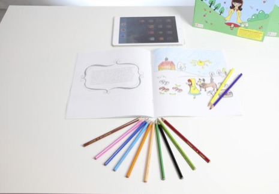
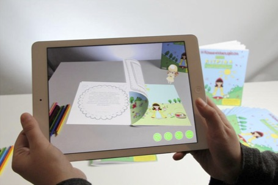

#### 2η Augmented Book από την Kob

Η εφαρμογή Mobile Augmented Book for Educaton είναι μια εφαρμογή που προορίζεται για την εκπαίδευση και στοχεύει σε χρήστες που απασχολούνται στο χώρο αυτό. Η εφαρμογή υποστηρίζει διαδραστική αλληλεπίδραση που περιλαμβάνει αρχεία κουίζ και σκορ. Η πρόσβαση στο επαυξημένο περιεχόμενο είναι δυνατή μέσω της σάρωσης QR Code που παρέχεται σε βιβλίο ή τυπωμένο χαρτί του που διαθέτει ο κατασκευαστής.
Όπως βλέπουμε τόσο από την περιγραφή της εφαρμογής όσο και από τις ενδεικτικές της οθόνες η σχεδίαση της προσπαθεί να καλύψει τους χρήστες που ασχολούνται με το χώρο της εκπαίδευσης και να καλύψει την οδηγία σχεδιασμού «what is wanted» που αναφέρεται από τους (Dix et al., 2003), καθώς και τα όσα περιγράφουν οι (Saraubon et al., 2016) και (Corrêa et al., 2013) για την ανάπτυξη και υλοποίηση ενός επαυξημένου βιβλίου.

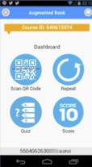
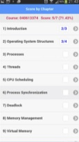

#### Solar Group - EPIC MAR Mobile Augmented Reality
Από μια αντίστοιχη εφαρμογή για εκπαιδευτικούς σκοπούς στο επιστημονικό πεδίο της αστρολογίας (Solar Group - EPIC MAR Mobile Augmented Reality) όπως αυτήν που παρουσιάστηκε στην προηγούμενη ενότητα (την LSS), βλέπουμε στα παρακάτω στιγμιότυπα του βίντεο λειτουργίας της, την κινητή συσκευή η οποία μέσω της κάμερας που έχει αναγνωρίζει τους υπερσυνδέσμους που περιέχονται στο βιβλίο και προβάλει σχετικό περιεχόμενο. Από τα αντικείμενα που εμφανίζονται στον οθόνη μπορεί ο χρήστης να επιλέξει και να αλληλεπιδράσει μέσω της οθόνης αφής όπως φαίνεται και στην εικόνα 2 (στη συγκεκριμένη επιλογή πατώντας στον κεντρικό πλανήτη εμφανίζεται η κίνηση των υπόλοιπων πλανητών γύρω από αυτόν). Επιπλέον, η εφαρμογή διαθέτει επιλογές για εμφάνιση επιπλέον πληροφοριών που ο χρήστης μπορεί να επιλέξει από την οθόνη διεπαφής όπως φαίνεται στην εικόνα 3.

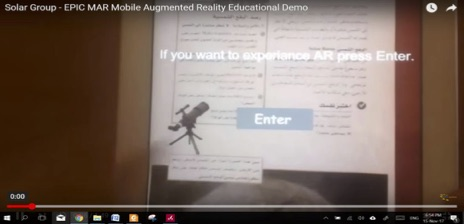
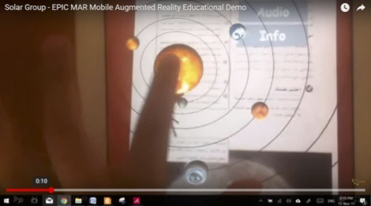
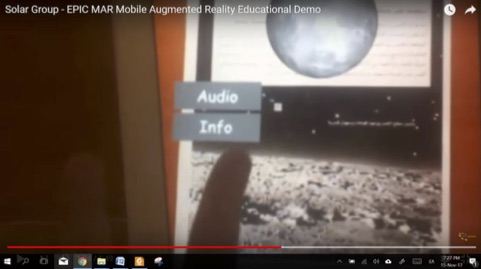

#### HeARt
Σε μία άλλη εφαρμογή (HeARt)ένα επαυξημένο βιβλίο για εκπαίδευση σε ιατρική σχολή, αναγνωρίζει την εικόνα της καρδιάς και προσομοιώνει τη λειτουργία της σε 3D όπως αυτή είναι στην πραγματικότητα (Εικόνα 4) και μάλιστα με zoom εμφανίζει εσωτερικά περισσότερες λεπτομέρειες του οργάνου αυτού(Εικόνα 5).

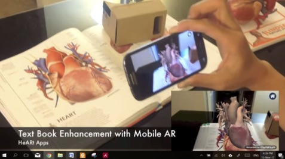
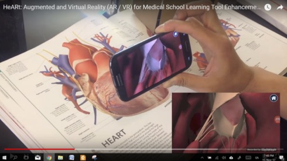

### Ερώτημα 3 – Προδιαγραφές εφαρμογής
Επειδή δεν υπάρχουν πόροι για την ανάπτυξη πολλών εναλλακτικών θα πρέπει να εστιάσουμε την προσοχή μας μόνο σε ένα υποσύνολο χρηστών και λειτουργιών της εφαρμογής.

Για τις αρχικές προδιαγραφές θα πρέπει να αναφέρετε:
1) προφίλ χρήστη,
2) στόχος χρήστη,
3) πλαίσιο χρήσης, καθώς και
4) τις βασικές οδηγίες σχεδίασης που θα εφαρμόσετε, όπως τις ορίσατε στο Α1
[10 μονάδες]

Απάντηση
Το βιβλίο που επιλέχθηκε προς αναμόρφωση, είναι η Ανάπτυξη Εφαρμογών σε Προγραμματιστικό Περιβάλλον (ΑΕΠΠ), βιβλίο 3ης λυκείου, πανελλαδικά εξεταζόμενου μαθήματος. Το βιβλίο εισαγάγει τους μαθητές στην αλγοριθμική σκέψη, με τη βοήθεια μιας δομημένης εκπαιδευτικής γλώσσας προγραμματισμού. Ο λόγος επιλογής, είναι η φύση του μαθήματος, οι δυσκολίες που αντιμετωπίζουν οι μαθητές, η ανάγκη εμβάθυνσης σε έννοιες, τα ελλιπή πολλές φορές παραδείγματα και επεξηγήσεις του βιβλίου, η δυνατότητα ενσωμάτωσης στην εφαρμογή ενός μεταγλωττιστή, ώστε σε προγραμματιστικό περιβάλλον να δοκιμάζουν τις ιδέες τους οι μαθητές, η ανάγκη επιπλέον εργαλείων και μεθόδων στη διάθεση του καθηγητή.
Συνεπώς:
**Προφίλ χρήστη:** παιδιά τρίτης λυκείου, προετοιμαζόμενα για πανελλαδικές εξετάσεις στην κατεύθυνση σπουδών Οικονομίας και Πληροφορικής. Ως χρήστης, μπορεί να θεωρηθεί και ο καθηγητής, σε μια διαφορετική εκδοχή της εφαρμογής.
**Στόχος χρήστη**: κατανόηση περιεχομένου, εμβάθυνση, ανταλλαγή σκέψεων και απόψεων με άλλους μαθητές ή καθηγητές.
**Πλαίσιο χρήσης**: στις ώρες του σχολείου, ως ενισχυτικό εργαλείο εκμάθησης, συνεργατικά ή ανεξάρτητα ο κάθε μαθητής στην προσωπική του συσκευή. Στη μελέτη στο σπίτι, ως αποθετήριο γνώσης, επανάληψη ύλης, επιπλέον παραδείγματα, τεστ, επικοινωνία με άλλους μαθητές ή καθηγητές.
**Βασικές οδηγίες σχεδίασης**: Ευχρηστία και ευχάριστη χρήση, προσαρμογή του περιεχομένου στις ανάγκες και το προφίλ του μαθητή, εκμετάλλευση της δυναμικής του ψηφιακού περιεχομένου, χρήση ανοικτών προτύπων, online και offline λειτουργία, ενσωμάτωση στην εκπαιδευτική διαδικασία, συνδέσεις με social media, chat, forum, επίγνωση πλαισίου.

## Μέρος B – Σχεδίαση της διάδρασης: 50 μονάδες

Σε αυτό το μέρος θα γίνει η σχεδίαση της διάδρασης για την εφαρμογή που μελετήθηκε στο πρώτο μέρος.

### Ερώτημα 1 – Ανάπτυξη Σεναρίου
Παρουσιάστε το σενάριο χρήσης της εφαρμογής σας. Για τον σκοπό αυτό είναι χρήσιμη η ύλη (σενάριο: Dix 5.5)  [10 μον.]

Απάντηση

9 το βράδυ, στα μέσα του Νοέμβρη. Ο βαρυς αέρας παρασύρει όσα ακόμη φύλλα επέμεναν στην άρνηση της πτώσης, και οι λιγοστοί διαβάτες βιάζονται ν' αφήσουν ολότελα μονάχους τους παγωμένους δρόμους της πολιτείας. Ο Δημήτρης, στη θαλπωρή του δωματίου, μελετά ΑΕΠΠ. Η ταξινόμηση του πίνακα με τον αλγόριθμο της φυσαλίδας, μοιάζει κάστρο που αντιστέκεται σθεναρά στις επιτιθέμενες δυνάμεις της αντίληψής του. Αποφασισμένος για πλήρη επικράτηση, ρίχνει στη μάχη τα μεγάλα όπλα. Ξεκινά στο smart phone την εφαρμογή The conqueror of the land of AEPP. Από την ομάδα των αρχικών επιλογών, χρησιμοποιεί το Scan QR code. Ο εκτυπωμένος στο βιβλίο QR διαβάζεται, και η εφαρμογή παρουσιάζει το σχετικό περιεχόμενο σε επιλογές. Ο Δημήτρης επιλέγει ένα βίντεο παρουσίασης του αλγορίθμου. Ο συνδυασμός της κίνησης και του κειμένου σκορπά το ομιχλώδες τοπίο του νου. Φωνητικά, η εφαρμογή αφού λάβει την θετική απάντηση ως προς την κατανόηση, προτείνει ως δοκιμασία την επίλυση μιας σχετικής άσκησης και ο Δημήτρης αποδέχεται την πρόκληση. Ανοιγει ο editor του μεταγλωττιστή και ο Δημήτρης με φωνητικες εντολές αναπτύσσει τον κώδικα. Η εκτέλεση του αλγορίθμου είναι ένας θρίαμβος. Παρασυρμένη η εφαρμογή, προτείνει εναλλακτικά, βίντεο με τροποποίηση του αλγορίθμου, ώστε να εκτελείται πιο γρήγορα. Την ίδια όμως στιγμή, το τσατ της εφαρμογής αναβοσβήνει. Είναι η Πηνελόπη. Ο Δημήτρης χαμηλώνει το φωτισμό, και ξαπλώνει. Η εφαρμογή προσαρμόζει το φωτισμό και τον προσανατολισμό της οθόνης. Είναι ώρα το σενάριο να τερματίσει, αφήνοντας τα παιδιά επιτέλους ήσυχα.

### Ερώτημα 2 – Περσόνα
Καταγράψτε σε μορφή [persona](https://www.interaction-design.org/literature/book/the-encyclopedia-of-human-computer-interaction-2nd-ed/personas) τους βασικούς χρήστες σας (περισσότερα από ένα personas) [10 μον.]

Απάντηση

**Δημήτρης Φ.**
Ο Δημήτρης είναι ένας μαθητής τρίτης Λυκείου, ο οποίος ακολουθεί την κατεύθυνση των σπουδών Οικονομίας και Πληροφορικής, πρόκειται δε να συμμετάσχει στις πανελλαδικές εξετάσεις στα μαθήματα Οικονομία, Ανάπτυξη Εφαρμογών σε Προγραμματιστικό Περιβάλλον, Μαθηματικά και Έκθεση.

**Background**
Ζει στην Αθήνα, στο κέντρο, στην περιοχή του Κεραμεικού. Έχει δυο αδελφές, με τη μεγαλύτερη να σπουδάζει και τη μικρότερη μαθήτρια Γυμνασίου. Πηγαίνει σε ένα δημόσιο Λύκειο των Πετραλώνων. Ο πατέρας του είναι καστανάς και η μητέρα του σοπράνο.
Μια από τις ήρεμες στιγμές της ημέρας, είναι η ώρα που ακούγοντας μουσική από τα ακουστικά του smart phone, περπατά στον πεζόδρομο της Ερμού βγαίνοντας βόλτα αργά το απόγευμα με το Σπίθα, το αγαπημένο του pug. Στα αριστερά το αρχαίο νεκροταφείο, στα δεξιά κι εμπρός ο ιερός βράχος, ενδιάμεσα αυτός, η μουσική και ο Σπίθας, σε μια από τις λίγες στιγμές της ημέρας όπου μπορεί να αφεθεί. Φορά πάντα τα αγαπημένα του αθλητικά παπούτσια, κι ένα συνδυασμό από τζην και φούτερ σε γήινες αποχρώσεις.
Ο ελεύθερος χρόνος του ειναι ιδιαίτερα περιορισμένος. Το σχολείο και το φροντιστήριο αφήνουν λίγες ώρες ακάλυπτες, οι οποίες καταναλώνονται ανάμεσα σε εργασίες, προετοιμασία για τεστ και μελέτη της ύλης. Μελετά αρκετά και σε βάθος, καθώς έχει από χρόνια στόχο να σπουδάσει Πληροφορική. Παρόλο που του αρέσει η λογοτεχνία του φανταστικού, εδώ και καιρό η μελέτη του έχει περιοριστεί στα σχολικά και φροντιστηριακά βιβλία. Το google είναι πάντα εκεί για να γεμίσει τις 5 ίντσες του κινητού του με πληροφορίες, το youtube επίσης για σχετικά με τη μελέτη του βιντεο. Η πληροφορία σε κάποιες περιπτώσεις αρκετή, σε άλλες ελλιπής ή και ανύπαρκτη για όσα τον αφορούν. Σίγουρα όμως αρκετά διασκορπισμένη, αδόμητη και μη στοχευμένη, κάτι που πολλές φορές τον κουράζει.
Μελετά στο μοντέρνα διακοσμημένο του δωμάτιο, είτε στο γραφείο είτε στο κρεβάτι. Πριν κοιμηθεί, βγάζει τα γυαλιά, χαμηλώνει τον ήχο της μουσικής στα ακουστικά και το φωτισμό του δωματίου, και βυθίζεται στο ενδιάμεσο του συνειδητού και του ασυνείδητου, σε μεγάλες και μικρές περιπέτειες και ταξίδια που τόσο θέλει να κάνει σε ολόκληρη τη γη.

**Computer use**
Ο Δημήτρης είναι native των smart phones. Επικοινωνεί στο android κινητό του με τους φίλους του μέσω instant messaging και social media, ακούει μουσική και βλέπει ταινίες σε αυτό, το χρησιμοποιεί για να φωτογραφίζει τα όσα αστεία ο Σπίθας κάνει, αναζητά όσα του ενδιαφέρουν. Χρησιμοποιεί την οθόνη αφής με εκπληκτική ταχύτητα. Το στερείται αναγκαστικά την ώρα του μαθήματος, υπακούοντας σε έναν ακατανόητο γι αυτόν κανόνα. Μεγάλος του φόβος, πέρα από  το απόλυτο έρεβος, το να μείνει από μπαταρία.

**Workday και σχετικές μέθοδοι**
-Ξύπνημα στις 7. Πρωινό και περπάτημα για το σχολείο.
-Παρακολουθεί τα μαθήματα, κρατά σημειώσεις, πολλές φορές μια οπτική αναπαράσταση μιας έννοιας ή μιας λύσης τον βοηθά στην κατανόηση, σχεδιάζει πολύ στις σημειώσεις του.
-Επιστρέφει στις 2 στο σπίτι. Τρώει και ξεκινά μελέτη. Αν θέλει έναν κανόνα να τον θυμηθεί, τον επαναλαμβάνει φωναχτά. Προσποιείται ότι διδάσκει κάποιον άλλο σε αυτό για το οποίο έχει αμφιβολίες, τον βοηθά να εντοπίζει απορίες και προβληματισμούς. Αναζητά πληροφορίες στο κινητό του, μιλά με φίλους ψάχνωντας μια λύση ή βοηθώντας κάποιον άλλο. Θα ήθελε να επικοινωνήσει κάποιες φορές και με κάποιον καθηγητή, δεν έχει όμως είτε τον τρόπο, είτε το θάρρος, είτε την πεποίθηση ότι είναι πρέπον.
-Στις 7 ξεκινά για το φροντιστήριο, από το οποίο επιστρέφει στις 10. Κάποιες φορές στο φροντιστήριο έχει ηχογραφήσει τα όσα ο πληροφορικός λέει. Παράνομο ξεπαράνομο, γι αυτόν έχει αποδειχθεί λυτρωτικό σε κάποιες περιπτώσεις.
-Επιστρέφοντας στο σπίτι τρώει κάτι και μελετά για όσο τα βλέφαρα κι ο νους ακόμη επιτρέπουν. Κοιτά το ηλεκτρονικό του ημερολόγιο για τυχόν εκκρεμότητες των επόμενων ημερών. Φορτώνει την τσάντα για την επόμενη ημέρα και νιώθει από το βάρος της σα να πρόκειται να μεταναστεύσει. Θα ήθελε τόσο πολύ κάποια από τα βιβλία να τα έχει απλά στο κινητό.

**Future Goals**
Να σπουδάσει πληροφορική, να γίνει μεγάλος και τρανός επιστήμονας, να ταξιδέψει σε όλα τα μήκη και πλάτη, να ανακαλύψει τον τρόπο τα παιδιά του μέλλοντος να μη μοιάζουν με όρθιες χελώνες με όσα κουβαλούν κάθε πρωί στις τσάντες, να τιμηθεί με το βραβείο Turing για την ανακάλυψη του κινητού δίχως μπαταρία, και τη στιγμή της απονομής ανάμεσα στο πλήθος και τα φλας, να λάμπουν περισσότερο κι από αστερισμοί τα γεμάτα θαυμασμό γι αυτόν μάτια της Πηνελόπης. Σε όλα αυτά, ο Σπίθας εννοείται πλάι του.

### Ερώτημα 3 – Ενδεικτικές οθόνες
Για το σενάριο και τις περσόνες που αναπτύξατε στα παραπάνω σχεδιάστε ενδεικτικές οθόνες με χρήση [κάποιου εργαλείου κατασκευής υποδείγματος](http://concept.ly/). Για τον σκοπό αυτό είναι χρήσιμη η ύλη (ενδεικτικές οθόνες Dix 5.7) [10 μονάδες]

Απάντηση

**Εικόνα 1**

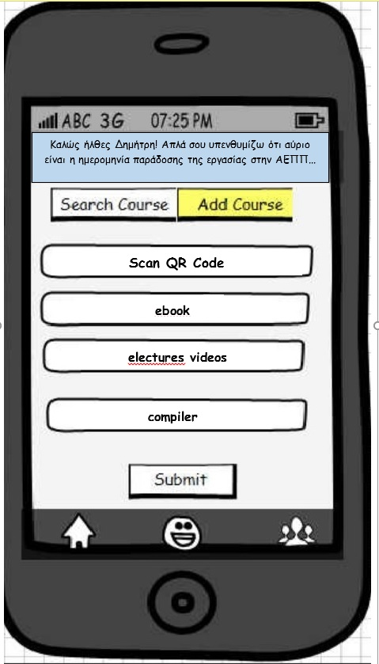

Η αρχική οθόνη της εφαρμογής καλωσορίζει το χρήστη και συνδεόμενη με το ηλεκτρονικό του ημερολόγιο αποφασίζει να εμφανίσει υπενθύμιση (στοιχεία αυτενέργειας της εφαρμογής). Ο χρήστης έχει δικαίωμα:
-να αναζητησει θέμα ή και να προσθέσει κάποιο στη συλλογή του
-να σκανάρει το QR code και να λάβει σχετικό περιεχόμενο
-να διαβάσει το βιβλίο σε ηλεκτρονική μορφή
-να επιλέξει την παρακολούθηση κάποιων βίντεομαθημάτων
-χνα χρησιμοποιήσει τον ενσωματωμένο compiler
-να επικοινωνήσει με συμμαθητές ή καθηγητές

Εναλλακτικά, και ίσως προτιμότερα, οι επιλογές κειμένου θα μπορούσαν να αντικατασταθούν απο εικονίδια.

**Εικόνα 2**

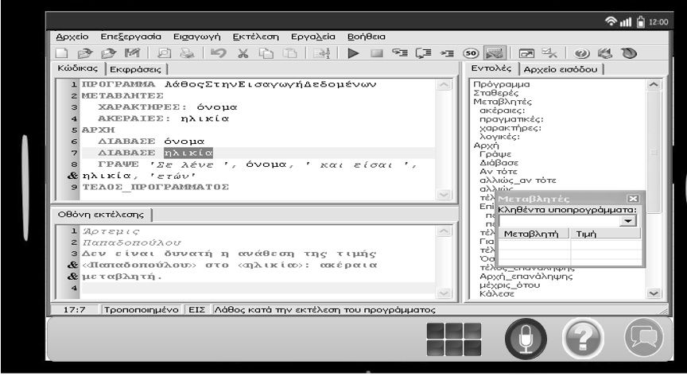

Η εικόνα αντιστοιχεί στην εκτέλεση του compiler. Ο compiler μπορεί να δεχθεί τις εντολές είτε φωνητικά είτε με πληκτρολόγιο. Οι επιλογές αυτές υπάρχουν στο δεξί κάτω μέρος της οθόνης. Στο ίδιο σημείο ενδεικτικά εμφανίζονται δύο ακόμη επιλογές, του chat και της βοήθειας.

### Ερώτημα 4 – Σχεδίαση customer journey
Σχεδιάστε το [customer journey](https://www.nngroup.com/articles/customer-journey-mapping/) της εφαρμογής μαζί με την σύντομη τεκμηρίωση (εξήγηση των επιλογών) και περιγραφή της διαδικασίας που ακολουθήθηκε [20 μονάδες]

Απάντηση

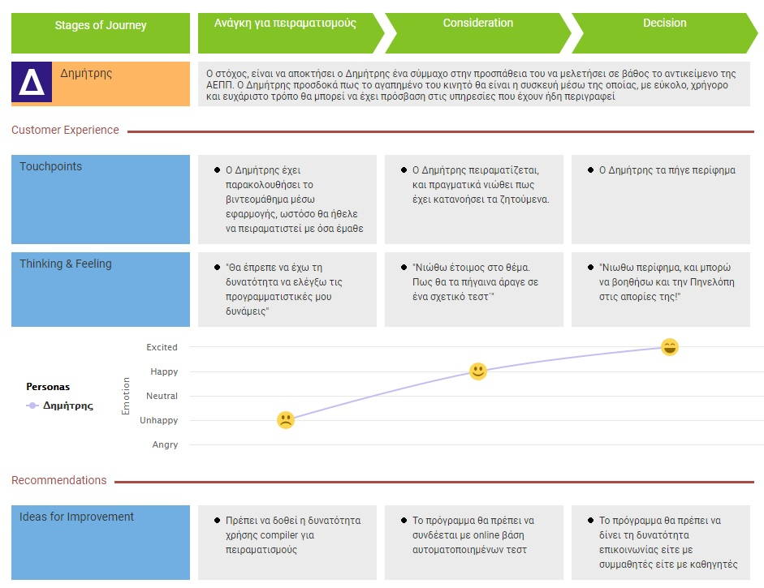

## Μέρος Γ – Συνεργατική ανάπτυξη στο github, 1.5 μονάδες μπόνους

Για την καλύτερη εξοικείωση με το σύστημα github καθώς και για την έμμεση μελέτη σχετικού θεωρητικού περιεχομένου:

A) Δημιουργήστε ένα αντίγραφο (fork) της [ιστοσελίδας του βιβλίου](https://github.com/pibook/pibookgr)

B) προσθέστε (commit) τα παρακάτω, A: 1) πέντε [νέες εικόνες](http://www.pibook.gr/gallery/), 2) δύο [νέα μοτίβα](http://www.pibook.gr/remix/). Αν θεωρείτε πως οι αλλαγές σας θα είναι χρήσιμες και για το αρχικό αποθετήριο, τότε μπορείτε να κάνετε και pull request

Η βαθμολόγηση θα γίνει με βάση την [συμβατότητα](http://www.pibook.gr/contribute/) με το περιεχόμενο που υπάρχει ήδη (δλδ, απαιτείται προσεκτική μελέτη του περιεχομένου) και όχι με βάση την ποσότητα της συνεισφοράς. Η απάντηση θα πρέπει να περιλαμβάνει ένα λινκ στο αντίστοιχο δικό σας αποθετήριο στο github, καθώς και τα επιμέρους λινκ προς τα αρχεία που έχετε αλλάξει.

Απάντηση

gallery

https://github.com/evabat/pibookgr/commits/gh-pages/_gallery

https://github.com/evabat/pibookgr/commits/gh-pages/images

remix

https://github.com/evabat/pibookgr/commits/gh-pages/_remix
